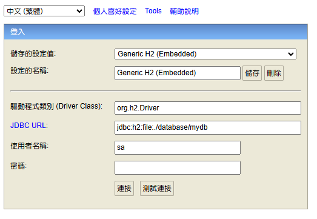
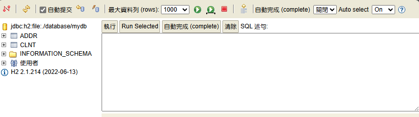

# 設定 H2 Database

H2 資料庫 是一個 可以透過 Spring Initializr 進行安裝 的 輕量級資料庫。

---

## 設定 配置文件

開啟 `application.properties` 文件 進行以下設定

1. H2 的 JDBC 設定
   
   - `url`：後綴的`file:./database/mydb` 代表 檔案模式，
     會在 `./database/` 這個資料夾內，建立 DB 的 實體資料檔案，檔名為 `mydb`。
   
   - `driver-class-nam`：Database Driver 設定
   
   - `username`：帳號
   
   - `password`：密碼
   
   ```yml
   spring:
     application:
       name: flowable-case-demo
     datasource:
       url: jdbc:h2:file:./database/mydb
       driver-class-name: org.h2.Driver
       username: sa
       password:
       # Hikari 連線池（Spring Boot 預設）可自行調整
       hikari:
         maximum-pool-size: 20
   ```

2. H2 控制台
   
   有這個設定，當專案運行後，
   可以訪問 http://localhost:9010/h2-console 前往 DB 操作頁面，
   進行 SQL 指令操作。
   
   ```yml
   spring:
     h2:
       console:
         enabled: true
         path: /h2-console
         settings:
           web-allow-others: false
   ```
   
   
   
   

3. 啟動 初始化 SQL 文件
   
   - 於 `src/main/resources/` 新增檔案 `schema.sql`。
     並於 這個檔案中，撰寫 `CREATE TABLE SQL`。
     
     ```sql
     -- 客戶資料檔
     CREATE TABLE IF NOT EXISTS clnt ( 
         clinet_id   CHAR(10),   -- 客戶證號
         names       CHAR(40),   -- 客戶姓名
         sex         CHAR(1),    -- 客戶性別
         age         INTEGER     -- 客戶年齡
     );
     
     -- 客戶地址檔
     CREATE TABLE IF NOT EXISTS addr (
         client_id   CHAR(10),   -- 客戶姓名
         addr_ind    CHAR(1),    -- 地址指示
         address     CHAR(72),   -- 地址
         tel         CHAR(11)    -- 電話
     );
     ```
   
   - 進行下面這個設定，當專案啟動時，會訪問 `schema.sql` 並執行內部 SQL 指令。
     
     ※ 非必要，也可選擇自行於 控制介面 執行 create table。
   
   ```yml
   spring:
     sql:
       init:
         mode: always
         continue-on-error: true
   ```

4. JPA 配置
- `spring.jpa.hibernate.ddl-auto`：設定 JPA 的 DB 行為模式。

- 一般建議使用 `none` 以免影響對 Database 造成不良影響。
  
  - `none`：不會對資料表進行任何異動。
  
  - `validate`：啟動時驗證 `entity`，不匹配會 `報錯`，但不進行任何調整。
  
  - `update`：啟動時比對 `entity` 和 `資料表`，有 `新增字段/索引` 會更新 `資料表`，但不會進行 `刪除處理`。
  
  - `create`：啟動時會 `刪除資料表` 並 依照 `entity` 重新建立資料表。 

- `spring.jpa.show-sql`：進行 JPA 相關操作時，是否要在 訊息序列 中顯示 `SQL語句`，這裡設定 要顯示。

```yml
spring:
  jpa:
    hibernate:
      ddl-auto: none
    show-sql: true
```
