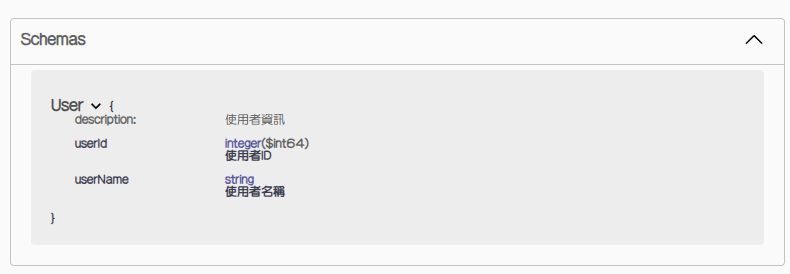

# dto - 與資料庫無關的資料傳輸物件

`dto` 資料夾是用來存放「資料傳輸物件（DTO）」的地方，這些物件主要用於封裝傳遞資料，與資料庫無關。

所有與資料庫 (DB) 無關的資料傳輸物件，都應該在此資料夾內進行設定。

---

## 建立 DTO

接下來，讓我們試著建立 `User` 這個 DTO 來保存 使用者資訊。

1. 首先 讓我們 創立 `dto` 資料夾，並新增一個檔案 `User.java`。

2. 開啟 `User.java`，並依照下面範例 新增相關程式。
   
   - `dto` 沒有 `Spring Boot 註解`。
   
   - `Scheam`：Swagger 的 `註解`
     
     - `description`：設定 詳細描述。
   
   - 欄位 會設定成 `private`。
   
   - 必須要有 `getting 方法` 和 `setting 方法`。 (透過 IDE 可以自動生成)
   
   ```java
   import io.swagger.v3.oas.annotations.media.Schema;
   
   @Schema(description = "使用者資訊")
   public class User {
       // 欄位定義
       @Schema(description = "使用者ID")
       private Long userId;
   
       @Schema(description = "使用者名稱")
       private String userName;
   
       // getting 和 setting
       public Long getUserId() {
           return userId;
       }
   
       public void setUserId(Long userId) {
           this.userId = userId;
       }
   
       public String getUserName() {
           return userName;
       }
   
       public void setUserName(String userName) {
           this.userName = userName;
       }
   }
   ```

## 範例演示

這裡僅先演示 `@Schema` 在 `Swagger UI` 呈現出來的效果。

需要等到 `controller` 設定完畢 且 有實際使用這個檔案，才能在 `Swagger UI` 顯示，


