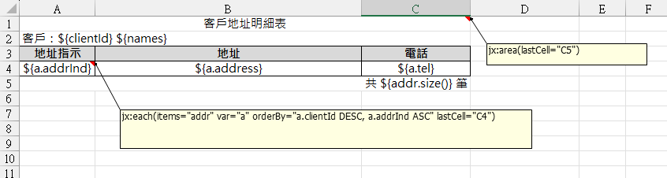
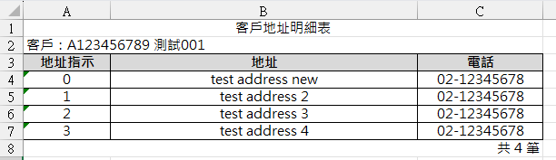
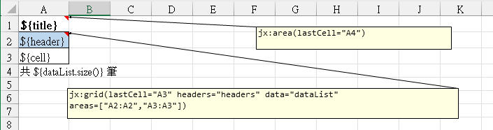
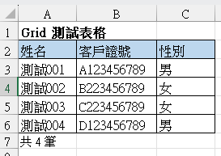

# 報表 - Excel 檔案

使用 `JXLS 2` 這個套件，來產生 Excel 檔案。

此套件 源自於 `apache.poi`，還可以透過 `樣版檔` 來達成 快速產生 Excel 檔案。

其運作流程為

1. 設定 樣版檔
   
   - 樣板變數 `${ }`。
   
   - 透過 Excel 的 註解 來 撰寫 jxls code。
   
   - 支援 Excel 的公式 與 設定。
   
   不同類型的樣版設定方式，請詳 `範例`。

2. Java 設定 資料內容
   
   - 宣告 `Context context = new Context();`
   
   - 使用 `context.putVar(..., ...);` 設定資料內容
     
     - **參數 1**：設定 `樣版檔 變數名稱`。
     
     - **參數 2**：設定 `顯示的數值`。

3. 將 Java 資料內容 套入 樣版檔 中，即可產生 Excel 檔案。

![](data:image/png;base64,iVBORw0KGgoAAAANSUhEUgAAAhwAAAH+CAIAAABY+EA/AAAAAXNSR0IArs4c6QAAAARnQU1BAACxjwv8YQUAAAAJcEhZcwAAFiUAABYlAUlSJPAAADUYSURBVHhe7Z1PbCTXfefroI0YWRn3eiSjlYy8LdnZITyi0RkoWs5kAnW8swyhEA4NSBHhv+0dmKABwiGMRcKN4enDGtuYBAjnlL4IaMDAgAYMuHMQRogvrRtv5rEPc+Cxj9xbH7moel2vX72q6u5iV9WrevX54AuZrK5/pN+8D3/v1R/nCgAs4uLiQl8EkCOOvgAAyozj8I8aTEL7A7AKpAJmof0BWAVSAbPQ/gCsAqmAWWh/AFaBVMAstD8Aq0AqYBbaH4BVIBUwC+0PwCqQCpiF9gdgFUgFzEL7A7AKpAJmof0BWAVSAbPQ/gCsAqmAWWh/AFaBVMAstD8Aq0AqYBbaH4BVIBUwC+0PwCqQCpiF9gdgFUgFzEL7A7AKpAJmof0BWAVSAbPQ/gCsAqmAWWh/AFaBVMAstD8Aq0AqYBbaH4BVIBUwC+0PwCqQCpiF9gdgFUgFzEL7A7AKpAJmof0BWAVSAbPQ/gCsAqmAWWh/AFaBVMAstD8Aq0AqYBbaH4BVIBUwC+0PwCqQShUYjUZDn8Fg0AkxGAzkCqPRSN8+S2h/AFaBVGzi8vJyOBx2u929jz5ovvOW47P+9o3WuzWR3dYXO21Hy27ri3KF9bdvyA2b77y199EH3W53OBxeXl7qx0sD2h+AVSCVUjMajU5PTzudTutBs/7lG7UbL7ferR1/96XTx875J87V56vm/BPn9LFz/N2XWu/Wajdern/5RutBs9PpnJ6eplXQ0P4ArAKplI7Ly8t+v7/30QdrL7+0/vaNva0bnbYzfOqMf6srIfWMf+seqNN29rZurL99Y+3ll/Y++qDf769SxND+AKwCqZSF8Xjc6/W2H27Wbrzc/ptXTx87k9/pnX7OmfzOrWPaf/Nq7cbL2w83e73eeDzWz3sRtD8Aq0AqBWc0Gp2cnDTfeav++isH337ls3/We/aC5LN/dg6+/Ur99Vea77x1cnKy/OAY7Q/AKpBKMbm8vOz84h/X//SP19++cfR3L6cyQZJPzj9xjv7u5fW3b6z/6R93/+//WTgyRvsDsAqkUjQuLi4O9n9Qf/0Lnf+5NvqV3mWXKKNfOcffW6u//oWD/R9cXFzoP6cP7Q/AKpBKcTg7O9v76IPGn7za+5n5+ZK0Mvmd0/uZ0/iTV/c++uDs7Ez/mZEKQNlZX1+XdyGEqdfr+gaQPYPBoPWgufmN2uljvVO2JqePnc1v1FoPmoPBQP3ZkQpAuel0OrpJFA4ODvQNIDMmk0m/32+8+dpu64vDp3ovbGWGT90bLRtvvtbv9yeTCVIBKD2j0Ug3icJwONQ3gMxoPbjr/s6roRM1w6duY2s9uItUAGwgbgSMsa+cabz5WnffadSd3QdVUYtbqTxwf2T3B3/zNaQCYANxI2CMfeVM483XLn7tdrWDXzqtprP5dXfiIdwR2xF3TuXr7o85+KX77cWvkQqALcSNgDH2lTNSKiJn/+bsfdP9K97Cq7/q7o929m+z5UgFwCrCI2CMfeWPJhXZ2x58y6l/yX3EVunvU/mO+4McfMv9obRPkQqAVYRHwBj7yp9IqYhcfupKZf0rbo4+TOeRw/nEvaP+w+mZd/fdHyS8DlIBsI3wCBhjX/kzRyoyo185J4dO82vTP/kL/ewvr8Bqfs094YU1FlIBsA11BIyxLyMsIxWZ8W/dyYnt95zaq0572533Nj7vMn1K8bZ7Stvvuae3/OP3kQqAbagjYIx9GSGRVGQuP3X6x+6899ofuENMe990B8ryfp/KN91Dr/2B+0X/OHaMa06QCoBtqCNgjH0Z4XpSUTP6lVsrdNrupbr1L7kVQ6vpTo+n/ObH77i7rb3qHqLVdA93+njxANf8IBUACxEjYIx9mWJ1qWi5/NStJLr7bgHR/Jr8m2F6g4hI+AX1InKFza/PNmx+zd1Vd9/d7TXKkTlBKgAWIkbAGPsyRepSicvZv7lWEAnrRESuoN5Nkl2QCoCFiBEwxr5MkZtUChikAmAnrVZLXwR5gVSQCsBSDAaD2bA0pIT2Hg4LQCpIBWApOp1Oe/2rn+9ukbTSXv9qp9PRf9ElB6kgFYClQCqpB6lYFqQCkACkknqQimVBKgAJQCqpB6lYFqQCkACkknqQimVBKgAJQCqpB6lYFqQCkACkknqQimVBKgAJQCqpB6lYFqQCkACkknqQimVBKgAJQCqpB6lYFqQCkACkknqQimVBKgAJQCqpB6lYFqQCkACkknqQimVBKgAJQCqpB6lYFqQCkACkknqQimVBKgAJQCqpB6lYFqQCkACkknqQimVBKgAJQCqpB6lYFqQCkACkknqQimVBKgAJKI5UnjRuPQktTC8PDm/WDh+Gl299fu/WnY0H+sIVglTSytM7ztNn+kI3T5z7h6GFS26bPEgFIAFpS+XujhNF425ozWDu3fLWeXB4U9/UY75v7u7cvP1MXzjNs42a5wxfKg9v33FXvrsj94lUliB1qezfcV6EFoq8OJw6YyqGZ859b+V9x3ku1llCKu5WO6GF1wpSAUhA2lJx82yjtnMv4uv43N1xRBkRWU88OLw5k8qzjdrMNZ6rAkskUjNTi/h7lgp5ePuO8ApSWYJVpPLiUPn/xevoA0skUjO+RaZSkQp55twXXglJJXqHIa5XuyAVgATkIpWI+kPpx91P/fUj1vSIr1Qe3r4TKoP86kTus3b4cCqVJw15LE9mjbvGpTIYDIbDob40Y3q93mg00pfGs4pU9ETVELI6ERE6Ef99vuPsP5l9tL8TLZVw7TKnGEoUpAKQgIykogrB7cSDXb9mHdGnP2nMuv7gDgOVSjCzUSz3oOIQ05G02WqeSMSelVEvGUNSGQwG7Xa7VnN/V8usny6NRsNxnPX19U6ns4xdUpSKHMVyywthlyf+F36ESIRUZqNeMjFSeXpHbXchrusYpAKQgIykEhr+Ckx7RIyJTQejFlYqwRX8fT5puENh7n+nw2jhROrKS75SUV0imbN+RgipSBbaZRWpBPp6v2d/vuOKxP1v/KhU7GR7jFS01ahUAAyQl1QC1Ub4Qq/gqNTymV4XoGwrrTM9hGeaIK5+FMHkIpVIl0jC62eNJhVJnF1WkYqWfe9A6oiWtI6oSIRpAnj6mQkmTipP9O1U9HJn6SAVgATkJRUxuiUWhi7WundLOCB6yl0QHNGat2b0lWBapZLT1V/zXSIpjlQkml1Wl8q8ufSYkkKrVOZc/fXi0LNUcBhNrVSe3kEqALmQkVTUHmMqGNl3a524O/BVuxM7axI9bBUxgCb3FpKKN21zV59TuXdrqp8MpPLxxx8v4xJJo9Fo5cva2pp+EjEIu/xJ/T+vLhW1OpnFv9ZLW1nMkQTmVJ74+pkjlXiQCkAeZCSVcKUii4PA0NN0WEz+V+8IFALWSVSpqJcAqONs0zPJQCo///nPT09P9/b2luy7f/jDHw7zpV6v6ycRRb1ePzg4GA6HOVcqYrArfPXXdBAsJBW5nEoFwDA5SsWrGBq3wlcAz72+a/VKRchMuflROwF38G3ODH/iqMNfk8lkGbsUbfir0WgIl8zWT0Mqy1cqojqZ3fyoXYLsVyRycGzqDCoVAONkJZWG6KldgrPokX23IhW904/eJEGlMrtXP7AfdQ+pVyphScy3S3j9rImUSqPRODo6Oj8/19dOSSqxaFLxCw5tTkXdg1apRF7oFbnwGkEqAAlIWyr+EJYvBqWkcD9yK5XwnSJapRIYj9JlENptMHqlIjdX9uOVJrNDZDD8NUcSkXaZs35GqFKZ4xJJKlJZslKRLplJxStBZiLRhr9EKTO3TBFEX6C8KEgFIAFpS0XP7D4V2Y97M/NBT+jDX8q8S6xU9A5Dog9/zduPm3ylIlHtssz66dLwWOgSSSpSiSWmpFjyPhXtlnsZKhUAA+QiFfVBLF4i6olQ+eK6xyMoCf2+k9lYWfR9kcqnxZKKZDKZXFxc6EszJnwnynxWkYp+34kyQRJ5X6T66TJSiZNH3PKkQSoACchaKhVMUqmUglWkUvYgFYAEIJXUg1QsC1IBSABSST1IxbIgFYAEIJXUg1QsC1IBSABSST1IxbIgFYAEIJXUg1QsC1IBSABSST1IxbIgFYAEIJXUg1QsC1IBSABSST1IxbIgFYAEIJXUg1QsC1IBSABSST1IxbIgFYAEIJXUg1QsC1IBSABSST1IxbIgFYAEIJXUg1QsC1IBSABSST1IxbIgFYAEIJXUg1QsC1IBSABSST1IxbIgFYAEIJXUg1QsC1IBSABSST1IxbIgFYAEIJXUg1QsC1IBSABSST1IxbIgFYAEdDqd5mtfaq9/tfj5VuNWeGEB03ztS0jFpiAVgARcXFx0SoLjOPqionJ+fq7/oksOUkEqALbhOPyjNgZSQSoAtoFUDIJUkAqAbSAVgzQ33u786KXLT/UO1/pcfup0fvRSc+NtpAJgG0jFIOPx+Pgfjuqv/9HRx1+oSMly8Wvn6OMv1F//o+N/OBqPx0gFwDaQinEmk8nJv/5L483X9rZunH+i98LW5PwTZ2/rRuPN107+9V8mk4n88Wl/AFaBVIrD6elp8523Wu/WBr/Ue+RSZ/BLp/VurfnOW6enp/rPjFQALAOpFI3hcLi781frb9/oH7tzD+E+uiy5/NTpHzvrb9/Y3fmr4XCo/5w+tD8Aq0AqxWQ0GrW//2Htxh/utr7Y+5kz/q3eZRc24986vZ85u60v1m78Yfv7H45GI/1nC0L7A7AKpFJwBoPBwf4P6l++sfmN2smhO9Ed7seLkItfOyeHzuY3avUv3zjY/8FgMNB/khhofwBWgVTKwtnZ2dFPf9J487X1t290fvRSQab0zz9xLw5ef9udgT/66U/Ozs70814E7Q/AKpBK6RiNRp3HP2++81b99Vda79Y6bef0sdu5h3v8LHL+iXu4Ttude6+//krznbc6j3++cIxrDrQ/AKtAKuVlPB4Ph8NOp7P30QfNd95yHLejP/j2KyeHzvCpM/md7oNrZPI7d1cnh87Bt12BOY7TfOetvY8+6HQ6w+FQ3GiyIrQ/AKtAKjYxHA57vd7RT3/SetBce/klx3EnOVrvTnP83Zc6bbfI6LRdVcjIhcfffUmuvPkNVyFrL7/UetA8+ulPer3enCu4VoH2B2AVSMVuzs7Ohj7dblc+8rn1oCkjF3a7XbnyNWZHrgftD8AqkAqYhfYHYBVIBcxC+wOwCqQCZqH9AVgFUgGz0P4ArAKpgFlofwBWgVTALLQ/AKtAKmAW2h+AVSAVMAvtD8AqkAqYhfYHYBVIBcxC+wOwCqQCZqH9AVgFUgGz0P4ArAKpgFlofwBWgVTALLQ/AKtAKmAW2h+AVSAVMAvtD8AqkAqYhfYHYBVIBcxC+wOwCqQCZqH9AVgFUgGz0P4ArAKpgFlofwBWgVTALLQ/AKtAKmAW2h+AVSAVMAvtD8AqkAqYhfYHYBVIBcxC+wOwCqQCZqH9AVgFUgGz0P4ArAKpgFlofwBWgVTALLQ/gHLT6/U6Co7jqN92u119A4AsQSoA5ebk5MSJ5+joSN8AIEuQCkC5mUwm9Xpdl4nH2traeDzWNwDIEqQCUHriihXKFMgfpAJQeiKLFcoUMAJSAbCBcLFCmQJGQCoANqAVK5QpYAqkAmAJarFCmQKmQCoAliCLFcoUMAhSAbAHUaxQpoBBkAqAPUwmk0ajQZkCBkEqYBu/+Kf/LacWoGoc7u/rDQLyBamAbXx/7+Pju+98vrtFqpanD9598Ofv6g0C8gWpgG0glcoGqRQBpAK2gVQqG6RSBJAK2AZSqWyQShFAKmAbSKWyQSpFAKmAbSCVygapFAGkAraBVCobpFIEkArYBlKpbJBKEUAqYBtWS+XB4c3a4cPw8q3P7926s/FAX1ixIJUigFTANkorlbs7N28/0xdO82yj5jnDl8rD23fcle/uOLeeiHXmSeXB4U33bvP4FaJy75YTfz7FDFIpAkgFbKMUUnm2UZs9WqRxV18ikd361CK+VKRCHt6+I7wyType5q/g7mcx8/ZQgCCVIoBUwDZKIRU9D2/f8dSixq9OxLdCJ1OpPGk4O/fkmnd3GncXOGMZqYROQEvwfIoYpFIEkArYRgmlMhvFcusV0bnfuzX9wo8nEiEVZdRLRnPGUpWHMj0TkMqDw5ti/964mb8cqcAyIBWwjTJIZTrJMcUf43rScHtw979qd69vGPNRWCrBGRFXV8ElTxqRu7q7Mz26P8dz71b8+RQrSKUIIBWwjTJIRcvdHU8uyoiWtM60IvFME8TVj9LXL5CKW3zsBC0Sloo3rzOdoXGc2p2bchLFPZ+ClylIpSAgFbCNEkklenJeEH3llVapxF/9pUlFfBocUgtKRWrDM5wy5CXFxvAXLANSAdsol1SU6kSJXmdMV76zcVefU5EX/s6Tymx9dYY/VKmI8ig0WzMtpPSypoBBKkUAqYBtlEsqeoEiCUnFc0DE1V9TN8RLRb9UzNeDIhWhE3e8K5abt3ailVOgIJUigFTANsollaUrFVFtKDc/alcAu7MgSj3h7+FJIzQX4l4YJsykFx/hJX7m3ZhZnCCVIoBUwDbKJRW9IJBonfh0OkS/+kvdQ0SlEndviueksELCS/wgFVgWpAK2US6pLFepSJcoUvFKk5kz4oe/4hJWSHiJH6QCy4JUwDbKJZVAdaIS3Ynrlcos6UhFP4sZi/ZWhCCVIoBUwDZKIRW9+w7cza4s17vyFKSimEyfdQ9rxg+VCiwLUgHbKIVUSBZBKkUAqYBtIJXKBqkUAaQCtoFUKhukUgSQCtgGUqlskEoRQCpgG0ilskEqRQCpgG0glcoGqRQBpAK2gVQqG6RSBJAK2AZSqWyQShFAKmAbSKWyQSpFAKmAbSCVygapFAGkAraBVLKKfCFYHnHfDBb9tM34IJUigFTANpCKFvc5YyEZuAu1N7IsiPtQsqS9/Cpxn1GW7AyRSiFAKmAbBqWSvKeeZZVtwwnszX1IvvakyOR1gPtqL/0BlNkm+RGRShFAKmAbSCW0N1chgWcYu5pJ1l+7dUOo3Mk4ic2HVIoAUgHbuJZUlAfORz+FXnbBYhTI7e88ZAUQfGT9dCdRewjUDaLfjNxWPbfa4cPoI8763JknIvamjYAFlRN1kuJV9vdu3/GPmK7zlkzEu5DnBqkUAaQCtpFcKl6v6veYTxqip9YXBrvsac++uLP2v1X/0pdbqevH99qBI3pvQ5mdSZRUovbmv5fe+1atAAI7UbYSDguoNFH/nkr0n2JRkEoRQCpgG4mlEuhw/egDRLIjXror13fr/e2vdOt3bko9hLYNJHjEa5yJv5OpFfQfbRbFfNrQU2gALZckHXNDKkUAqYBtJJZKZCerL0zelbtS0ZEbitcvqt10SAMyqUhl1kHrY0raeSIVWA2kAraRWCp6SeElHamEdjv7yNlpBC7KCmvAT/CIs90ufSaBDdWCyT8TVXXRUmH4C5YFqYBtJJZKcPLDn1PxJhXUCY9pb7uoK5/9ZR3YbeTh1PUjtlWOGDWnova52hSItrfZPt0xN3V5QCreTqKlovXv6unN+Sn0b6M2j/t6zi8wNkilCCAVsI3kUpGdssesF1MWBnu6OKnMhpKmOxE+kLhrqlYIDCsFttW72qjrzdQzvPVEu6tDPxM34TE3uXC65w15z7wuleBIVD5S0c9hYZBKEUAqYBvXkkqRE9SYqWjSWirBobakSX5EpFIEkArYBlLJJolP49lGbZVpGB7TUlKQCtgGUskqPFASlgCpgG1YJxWybJBKEUAqYBtIpbJBKkUAqYBtIJXKBqkUAaQCtoFUKhukUgSQCtgGUqlskEoRQCpgG0ilskEqRQCpgG0glcoGqRQBpAK2gVQqG6RSBJAK2Mb39z5+8MaX2+tfrWa+1bgVXliRbH/lj5GKcZAK2MZwOOxUGMdx9EVVYjgc6g0C8gWpAFiF4/CPGkxC+wOwCqQCZqH9AVgFUgGz0P4ArAKpgFlofwBWgVTALLQ/AKtAKmAW2h+AVSAVMAvtD8AqkAqYhfYHYBVIBcxC+wOwCqQCZqH9AVgFUgGz0P4ArAKpgFlofwBWgVTALLQ/AKtAKmAW2h+AVSAVMAvtD8AqkAqYhfYHYBVIBcxC+wOwCqQCZqH9AVgFUgGz0P4ArAKpgFlofwBWgVTALLQ/AKtAKmAW2h+AVSAVMAvtD8AqkAqYhfYHYBVIBcxC+wOwCqQCZqH9AVgFUgGz0P4ArAKpgFlofwBWgVTALLQ/Qzzfd5z95/rSSJ7v33/6Ql+07MZ5cb2TfPH0/sJ1IBlIBcxC+zNAsCt9vu+E+mMXdy2d6VZLdNfXJ6CH4Mm9eHpfO+4qJ+l6NYKIX4a3ZsRycfSID6oMUgGz0P5yJqoX9gh1jbIH93t5ZcGC7noFnu+7u3aPsB/o8+8/ffHi6b57HmKNKdc9SffXEPqJQ4WL1M7MUwHCewCkAoah/RUTvfuccX9/P6ClNDtWedTwTmcyDNRYMcw7SW9P9++HpRJXskWMrEE8SAXMQvvLEa873X/u/m/ECJM+thRTBCiTMfoW025+ToGwDLIPV5whl+jde8KTdJfLXQQkEmeUwFFl9aOsHfxlAlIBw9D+ciI87OV2haGlwZGl4Gfux/vqoFJQKvpY0bWYdtvTkS4VOTSlD39ppzj/JINMhRA9FhbaubfK9Oi+SuYPslUSpAJmof0ZQ0hA60yVHjumCFD+clcLh2kNkOCisggC41n7T2d9+v2nTwMfhZWx1EmGEWNhc1YQJ6X/SPNMVXWQCpiF9pc7fs8tesXpX+MR/WpkESD6a/G/UT1rVA88JWoGRF/VdZpbpTwP79qVg7c4YIlrnaRAbBrz4QzPlvdFXRJ1tMV7qBhIBcxC+8sHpTtUOsHnz/2vZ5/rfeRsyuXp9JPZ0E9YRXOksgTiGIpZ/HN2J97d3XqFVMRxE51kpBoU1PN3z+OpuwtvP9JQ4S/AB6mAWWh/RvDrk/t+H6wTVVYIxES//G/EduGlSzJTgueE/f3pxErEDItH4pOcjfhFuEYQ2ECYSazrnlykjq7941oKUgGz0P7yRHaK2gBSXL84m4YOTki7Pe/TKKfMk0qUAiJXjVoxQNAHyU/SW3UJqcgbY/x1wwVKpFmrDVIBs9D+jDHtu72/wl+Iv8QDnyuzLaHrbb3PonrTOVJZBu+cYo8YseNrneSyUpniVyoRVYqPvkmVQSpgFtpfngQ6xllHOJ2y3pczLCrCPcFeczaMpLOiVFSCvXjUwWYkO8lrSSX6w/CSyoNUwCy0P4P43XZM/+rLxrtvRN7JIf/+V5ZFjVnF7XRJ/P25c/ayGIkiyUnOCJ2ugm4JpJIIpAJmof3liTaEE9Xb+ni9rtpfepPW7gVZ6sJ07/1TTy+0W/VD/8Svf5IpVCoLZFdZkAqYhfYHUG56vV5HwXEc9dtut6tvAJAlSAWg3JycnMgaMszR0ZG+AUCWIBWAcjOZTOr1ui4Tj7W1tfF4rG8AkCVIBaD0xBUrlCmQP0gFoPREFiuUKWAEpAJgA+FihTIFjIBUAGxAK1YoU8AUSKXwJLhJPuLuj6ibRLIj0QmE3tkYcY8KJEAtVihTwBRIpdC4N/jN+tnQ07WmaPdUeky3iu/S0+RaJxBWSISSIAGyWKFMAYMglcIS1VN7hHpe2T37vbKyIK5LT5XrnID4ZN7jWkI/JyxEFCuUKWAQpFJ24rtl981age+z6aSvdwLhqos6JQUmk0mj0aBMAYO4Uvnwez9U/+nD6vynl9dGo5H+y14e/4GMwWmH2fsVgwNHMYWCMhkT9dAsj5gyIiEJT2B6CnLVwK9uygon9o+/+Cd9b1AZPvzent4gIF9cqTT/4n3nl586//7/SFqp/dlfDodD/Ze9HOFe1u19Q0uVXjf0mfcgfXXgSenTlQEppWtfjUQnINyzvz/VpW5Il6hly/Ph9/acn951/n2XVC6/fND8iz/XGwTkC1LJJKtIJUzkm0m818ULYgoFZUQpbmgpwZVl80h2At6HsgaLEkjUsuVBKtUNUikASCWTpCOV2TtN3O/iH/UeWSiIPl38b2wnvUAqUdMlUasnOgFhQ1Uq+qYuUYdZEqRS3SCVAoBUMskKUlE6WaVjfS7fCjn7XO93Z1Mu/ouJ/Z47plDxZ27SIskJUKmQDIJUCgBSySQrSEXDr0/ua2+wl0RVEwIx0S//q5OWUq53AlQqJIMglQKAVDLJylKRXa3yF767LK6vnU2/B+8Mcbvzp+EuXahArx5CRPkivCuPpCdApUIyCFIpAEglk6wslQDTvt3thF+8cC8E06oWZbYldPtHZD3i7VBfuAKJT4BKhWQSpFIAkEomWVkqga521sGKxfv7coZFRbgn2BtHXDiWtlFmLHkCHlQqJIMglQKAVDLJylLR8B0T7pwFU9mIq6r8tWSNoCyLKgzidpqE5U9gtgFSIWkHqRQApJJJVpaK1vfP6/dDlYfXXz/XJmDiH8K1Mtc6AbnOHOb91HNAKtUNUikASCWTrCwVuD5IpbpBKgUgd6k8es957H/d6zpbv4n+SORx23n0++kXYs0t/a9Z53Y3sMmWM93J47b/0W/8L37v3G4HVs4sSMUgSKW6QSoFwKhUNG2IL9RESkUTjxZ1hV7Xcdq+VH7jOO85vdD62QSpGMRyqWw5ztY994vHDce56fTkRw+d2/5Hj246tzf0DXsbsz/FHod2a0eQSgEwJ5XHbbXemKHWLteXym/03Uq0yiabIBWDVEUqwiJSHq5jGtOvI6Ryz238jx76G/prWhakUgByk8rv3X8AM9RhqPhRqURSUUfGHnWj5dGLWZ52kIpBKiMVv/hwyw7VGVFScddUyxpLg1QKQG5SEfHUMrVCTDGhDY5JoudUtBEtuX9vyOvRe9rasbJJO0jFIBWSivCH09AtEpaKsI66oZVBKgUgX6m4kxxambJcpSKz9Z4bKZ6toFRm+/eloipqC6lUgmpJRdhCmyaJkIoYHxN/WvkFjX1BKgUgX6k8arsaED27XnNIFMFESuWxvGYsZKNHbbdSeeSvEK5U4obO0k6xpRJxL+JSzO5wLDRIJVoq8iMX5lQgK/KUilI9hK8e3oqaQletINbf8qqQqXjktcLK/sWky6N2bhd6RabIUkmsFOVGTO/2+BcvIm7Lv/69iqlTLamIb8UgmFw4RypyJsbKegWpFIAcpaLpJFBGiFGs3zu3g8NZ6sruF35pIsyh1TFiHTmTH1cJ5VKsFEQqUU8ZXoSqBn97XReuVLSCJfQgSXNUSCqzq4qV64kXSkWsjFQgG3KTyu+dLa+qCNcowiWPvDl5vXzxHTPdyi9NxF2TgQkVf/+qVKZ7UwqaiKNnkoJIJYT2wPtFz7+PMwVSMRbVB0GRqLethKXy6Gb0mpYFqRSA3KTiZ1Zz+H8ab3W9r8Nz9cqUidiq152VJu7fa8odLTJUKjHETIiIxTE+iDMFUjEQf+5EvRklMDWi3LYynTjxETqZ/Yuw1ChIpRiYkooft9rwKpXHijBE1Ie4TIfO/JkS9xEsbX2sbLrD8lUqo9Go0+mcn5/rH6TE8oNguhbiTIFUSDGDVAqAQanIe0r8qZRH7wUm3tX7HN2tlAEu+VAv/T6VMlUqwiXr6+vivBaun5zpfLrX/ctHzccTrmXiTIFUSDGDVAqAKan4PhDT9dIlszveg1d2PfIuRBbz8IGCJnRVcUSlEj565pkjFc0lkrj1UyL6gi1JaFjMI6LG8cyBVEgxg1QKQO5SqUbCUolziSR7qSTv9ONMgVRIMYNUCgBSySRSKgtdIkEqaYFUqhukUgCQSiap/dlf/vjHP17GJZJms9lKlc8++0z5P/q6w1+RppgrlaOjI/1U8uX1N99AKhUNUikASCWT1P7sL//jP/7j9PR0b29vbW1N78KjODk5GabKeDxW/o/Or1I5Pz/XTyVf3v/r/45UKhqkUgCQSiZR51Qmk8kydmH4Ky0Y/qpukEoBQCqZJDxRv9Au4fXTYMGoV4igKkKm8C4H23+OVFaMfGBwHJHPUJm+PcW7yVFniQdEPrrpPnTS7herIJUCgFQySaRUJJF2mbN+SsQ8lGVODSNN4btpahIpFdVZcTvJnbylor6mdw7qU4QfN+a92uRxIyAVeXv89Mkr4fc2hpdERUhlur6lXkEqBaAYUnHvkA89olhN3ENZYuO9ASyXW1IiM18qEtUuy6y/Am73H9fte2qI+nB2n0qwLomoVApE3lIJR7NCONeoVGYeCiskvCQqM6nMzeOG/tywRJk979J7rswyR0wxSKUAFEEq6usgY5JYKt59jkk3SS9LSkUymUwuLy/1pakRU6Pog2OBVWJNg1QWZhmpLF+p6JuEFaIuiRwciyTSQ97miU2gPNpSfYiy+hTLfIJUCkABpOK+rjH8NMlgriGVZXabWZJKJUvmTasEzLD8tAhSmZ9IK2grzGe2eUgSj+7pS1wiDRE66Pyzmg7lLbEr/UVhMVJZcm8pBqkUgAJIRXvkV2SuIRWjI2BFkkrlKIdU5vwJH7m5O7Oy2kRI5G61hJ+ZHxldKnEf5T4ChlQKQAGkogrjcVt5RqRiBbmOu4KPUFHcJmIr7cnHeQWpGKQcUpmPvvlDZ+umO7se0ZX7j8SfU9yISf7eRtTmwQSUEBwKc8+5oe9criw31Hzj/huc+6tIN0ilABiXijehonb98iHEqmzE1+6IVuixxHGbhL/NMUjFIOWQypz+Pbz54w3nkbfJ1k33aw3R7/dCR+xtBMoO7duIaG+EjJSK93W4UpkjlTk/aepBKgXAuFS82iJQT3hLbr8XmBGZ6iG8cvwmSw6sZROkYhDrpPLQ2dqYbtLbUEaTwjP2wegWubdIKl7Rk65UlhxPSytIpQAUUCr+8/C18mVac3jru4TeZh+5H6RSPYotlaixqWiUdwM/jvRQUqksvD0FqUAKGJdKaPjLHeNynC11piRqIEudSoncJHKrvIJUDFJsqSSNV6aoxU3cfEz4iFOpiEkXTyfuS4b8T7fCQmL4C1LAuFS0rt9zjPh29obHKD3M5ldiNlGX5x6kYpDySCXYa4s78+M2TFqpzNyjrDOrXWKGwmKVIMykSEXbPFoqyqXG+QSpFIACSEUdpHJHseS8iDIyJqSiXvolr/KK24RLiqtKGaQiBsGiBqPEQ1nCPf7yUhFyCu9BRFyOFXeG+miVf2mZ0wjcdCKfTCNPKVoqXFJcRQoglYzuUsxot8sFqRgkX6kknyPZitGJmvBtg1OpyF4+TJRgIuLtIU454eOuknT3tkyQSgEogFSWeUzLNVKqx7RAiuQrFcsSHJFbMTympZIUQSpLPFAycUyOfSEVsyCVlbLiAyVnyX3sC6kUg2JIxbogFYMgleoGqRQApJJJkIpBkEp1g1QKAFLJJEjFIEilukEqBQCpZBKkYhCkUt0glQKAVDIJUjEIUqlukEoBQCqZBKkYBKlUN0ilACCVTIJUDIJUqhukUgCQSiZBKgZBKtUNUikASCWTIBWDIJXqBqkUAF8q3/yOs3dc9Hz0v5z/8QN9YSGz9sZ/QSqmcKXy395w9tZJ5fLNryAV47hSGQ6HnTLw93//97VaTV9aSLrd7mQy0X/ZkAvn5+f6/x9QGfhjzjiuVMrCxcVFo9HQlwIAQGEok1Tc03VKdsIAAJWiZH00UgEAKDIl66MbjcbFxYW+FAAAikHJpLK7uzsYDPSlAABQDEomlePj4263qy8FAIBiUDKpDAaD3d1dfSkAABSDkkmFq4oBAIpMyaTi3v/fbJ6fn+tLAQCgAJRPKuK+WX0pAAAUgPJJ5ezsbHNzU18KAAAFoHxSubq6qtfr4/FYXwoAAKYppVS63e7x8bG+FAAATFNKqYzH40ajwWOAAQCKRimlcnV11W63+/2+vhQAAIxSVqmcn583m019KQAAGKWsUqFYAQAoICWWCjMrAABFo8RS4fmSAABFo9xSmUwm6+vrvGEFAKAglFsqV1dXw+Gw1WrpSwEAwASll8rV1dXBwUGv19OXAgBA7tggFQbBAAAKgg1SEbetbG5uciUYAIBZLJHK1dXV6enp3t6evhQAAHLEHqlcXV0dHR2dnJzoSwEAIC+sksrV1VWr1RoOh/pSAADIBdukcnl52Wq1eN8wAIARbJOK8Mrm5uZoNNI/AACAjLFQKldXVxcXF61Wi4uMAQByxk6pCK80m028AgCQJ9ZKRdYrjIMBAOSGzVIRXtnc3GTeHgAgHyyXirwe7OzsTP8AAADSxn6pSK/w0EkAgKyphFTEQycPPHg+GABAdlRFKoJer9dqtcbjsf4BAACkQbWkcnV1dXZ21mw2mWIBAMiCyknl6upqPB5vbm7ycnsAgNSpolQEx8fHDIUBAKRLdaUi3m/fbDY/++wz/QMAALgWlZaKGArb3t5ut9uXl5f6ZwAAkJCqS0XQ7/fX19cpWQAAVgSpTKFkAQBYHaQSQJQs3HsPAHA9kIrOeDw+ODhoNpu8lhgAIClIJZrz8/NWq7W7u8sbWQAAlgepzGMwGKyvrx8fHzPRAgCwDEhlAZPJpNvtMtECALAMSGUpmGgBAFgGpJIAOdHC8ygBACJBKokZDAabm5utVoubJQEANJDKNRkOh9vb281m8/T0VP8MAKCqIJWVOD8/39vbazQa/X6fd0oCACCVFLi4uGi3241G4+TkhIuPAaDKIJXUGI/HR0dHjUaj0+nwmhbL6Pf7DqTNycmJ/ouG8oNUUuby8rLT6TQajXa7zUVi1tDpdJzNtnP0OUktm+1Op6P/oqH8IJVMmEwm/X5/c3NT3DXJmFjZQSrpB6lYClLJltFodHBwUK/X2+02N06WF6SSfpCKpSCVPBCFS6vVajQa3W6XGZfSgVTSD1KxFKSSKxcXF8fHx/V6fW9vj3snSwRSST9IxVKQihlOT0+3t7fr9frx8fFoNNI/hoKBVNIPUrEUpGKS8XgsHoG8vr7e6XSwS2FBKukHqVgKUikEo9Go0+msr683Go2jo6Pz83N9DTAKUkk/SMVSkEqxuLi4ODk5aTabwi5cMFYQkEr6QSqWglQKirBLq9Wq1+sHBwfM6psFqaQfpGIpSKXojMfjXq+3vb1dq9Xa7fZgMOBWyvwpt1Q2HGfX+2J3x3nj0Fv4xP/imfPGjr6+mvfvOBtP9IWpBKlYClIpDZeXl/1+f3d3t1arbW5uHh8f8xiY3LBEKkefO+1Dx9nxpfLEce44bWVN99MleP+ZfohrBKlYClIpJWdnZ91ud3Nzc21tbXd39+TkhCvHMqXoUtlw5tUTU6k80d0gmVYtnlTU/ag2knn/DlKBOSCVcjOZTAaDwdHRkbhyrN1un56ecsd+6qQmlffvBLvzuUNPyydOKhvKod4/nMlDTTtm+e5OYJ/at6sHqVgKUrGHi4uLfr+/t7dXr9ebzebx8THT+2mRplQie/AVEycVN8+cN/xK5Y3DkNWCstnd0T+NhEoF4kEqdnJ+ft7tdre3tx3H2dzcPDo6Oj09vbi40NeD5SixVKbTJP48yvt3AiNaG5EVzDPnjeBcS1pDXmqQiqUgFfs5Ozs7OTkRrz2u1Wrb29udTmc4HPL+4+XJVipufSA7cW/mY9rve0WGYOoMZYk6dDZHKu/vuJu870+WhCuViFmTHaetHsgjfNorBqlYClKpFpeXl5999lmn02m1Wmtra81ms91u93o97uGfT5pSUZEd+obfa8/04HXrUhXunHlwieqnWKl41YmYb3dVEV4hGO303jh0hSdqlNmFYcEi5tpBKpaCVCrN+fl5v98/ODhoNptra2utVqvT6QwGA64l00hTKtF/8nsFyht3ZvWH24mHr/dVlygXBMdJRQx2yYu41Hl7lXCxIiOlknqQiqUgFZgymUyGw2Gn09nd3V1fX3ccp9Vqtdvuv/zhcFjxK8qyl4pfJcge3B0TC14bFnkTibRFhFSeORt+9SNXm/pD3vzoi0ff1g9SgYQgFYhlOBz2+30xVlav10Upc3BwcHJyMhwOK3Vjf+ZSEcLYUCZX9LokaolMtFSUT5eqVELzKLGkcSU0UrEUpALLIkqZXq93dHTUarVqtVq9Xm+1WsfHx71ez+6Z/4ylokyWyMmVhXMqapaXyrKVin+9wLRS8b6dc4hrBKlYClKB6zMej4fDYbfbPTg4EDP/4gpmYRoxblbMBy33+/3Nzc1er7fksF6aUgn/ye8ulH/7e933dMRJuQc+4uovpWJYXiqRBKQiDurvWR3+EnexzDlQoiAVS0EqkDJnZ2fCNGLcrNVqOY4jhs7E1czdbnc4HJq93qzf78sedXt7u9/vzx/NS00qRhJRqShRK5XAxc3+Em1OJbrYSh6kYilIBfJADJ2Jq5mPj49brVaz2XQcp1arCfGIykb4JgflqFIRrK2t7e3tnZ6e6qt6lFsqxQxSsRSkAia5vLwUFhGVjfCNVI7jOGLaRlwg0PEYDAZik1WmcMJSkYhXDGhPuEEq6QepWApSgUIjpm3EBQJCKru7u0IzYgpHIJZIRN0jkR4SjMfjOVKRiNejiZoJqaQfpGIpSAVsQHWGrHsk0kOCer2uC2QujUbjb//2b5FKykEqloJUoIosU6k4jrO+vt7pdEajEZVK+kEqloJUoIrMl8rm5ubJyYn6UGekkn6QiqUgFagikVLZ3t6Ou3MFqaQfpGIpSAWqiJSKuJLY8vtUihmkYilIBarIYDAQr15e8rrk/KSyuxN4TEv4XsXVM72r37vJUb7qUT6LJYsjRgapWApSAVhMXlJRRZKlVAKPWvEOJG6b1z/KMkjFUpAKwGJykor7HGL5ELCEUpn/+C81ujkUqQROIOMgFUtBKgCLyUkqgcdqmZBKniNgSMVSkArAYnKSSkAMQiryQcXKSx7V5zm6HvLeQi/R9jBFqT/mScXbf0Zv5dKCVCwFqQAsJhepBDv3qRJ8l8jH4wceJKxsolcqwZevqDXQQqksWfGsGKRiKUgFYDG5SEV9k0p4+EsOTGlTIDGvqddfE6m80H6+VNJ6sv3CIBVLQSoAiymSVJR+XxVAhFRCyM2RCmQGUgFYTC5SiRr+klIRkph+KwQTXCFCKjEvtJ8vFYa/YDWQCsBicpFK1ER9eE5FrukSXBKoMIJzKmrmSSV+q9SDVCwFqQAsJiep6JcU33F25ShW6C2/2uvi5XiXriWJb6B5UuGSYlgVpAKwmJyksvy9h3NGtxZmjlSWP4HVg1QsBakALCYnqeiT8/FZZTp9jlT0j7IMUrEUpAKwmLykoj5Qck60Kf2E4YGSkCVIBWAx+UmlOkEqloJUABaDVNIPUrEUpAKwGKSSfpCKpSAVgMUglfSDVCwFqQAsBqmkH6RiKUgFYDFIJf0gFUtBKgCLQSrpB6lYClIBWAxSST9IxVKQCsBikEr6QSqWglQAFuNK5VbT9Urx81+/qS8pZm41kYqVIBWAxVxeXnZKguM4+qKicnFxof+iofwgFQCrcBz+UYNJaH8AVoFUwCy0PwCrQCpgFtofgFUgFTAL7Q/AKpAKmIX2B2AVSAXMQvsDsAqkAmah/QFYBVIBs9D+AKwCqYBZaH8AVoFUwCy0PwCrQCpgFtofgFUgFTAL7Q/AKpAKmIX2B2AVSAXMQvsDsAqkAmah/QFYBVIBs9D+AKwCqYBZaH8AVoFUwCy0PwCrQCpgFtofgFUgFTAL7Q/AKpAKmIX2B2AVSAXMQvsDsAqkAmah/QFYBVIBs9D+AKwCqYBZaH8AVoFUwCy0PwCrQCpgFtofgFUgFTAL7Q/AKpAKmIX2B2AVSAXMQvsDsAqkAmah/QFYBVIBs9D+AKwCqYBZaH8AVoFUwCy0PwCrQCpgFtofgFUgFTAL7Q/AKpAKmIX2B2AVSAXMQvsDsAqkAmah/QGUm1ar5cTTaDT0DQCyBKkAlJter6ebROH4+FjfACBLkApAuRmPx7pJFM7OzvQNALIEqQCUnrgRMMa+IH+QCkDpiRsBY+wL8gepAJSeuBEwxr4gf5AKgA2ER8AY+wIjIBUAGwiPgDH2BUZAKgA2EB4BY+wLjIBUACxBHQFj7AtMgVQALEEdAWPsC0yBVAAsQR0BY+wLTIFUAOxBjIAx9gUGQSoA9iBGwBj7AoMgFQB7ECNgjH2BQZAKgFW02219EUCOIBUAq7i8vNQXAeTI/wcUwL9Pc5DP+QAAAABJRU5ErkJggg==)

---

## 安裝依賴

```xml
        <!-- apache.poi -->
        <dependency>
            <groupId>org.apache.poi</groupId>
            <artifactId>poi</artifactId>
            <version>5.2.3</version>
        </dependency>
        <dependency>
            <groupId>org.apache.poi</groupId>
            <artifactId>poi-ooxml</artifactId>
            <version>5.2.3</version>
        </dependency>
        <!-- JXLS -->
        <dependency>
            <groupId>org.jxls</groupId>
            <artifactId>jxls-poi</artifactId>
            <version>2.12.0</version>
            <!-- 排除其自帶的 POI -->
            <exclusions>
                <exclusion>
                    <groupId>org.apache.poi</groupId>
                    <artifactId>*</artifactId>
                </exclusion>
            </exclusions>
        </dependency>
```

## 工具

- `generateExcel`
  產生 Excel 檔案
  
  - 參數為 `Context` 的方法，針對 一組資料 的套印方法。
  
  - 參數為 `Map<String, Context>` 的方法，針對 多組資料的套印方法。
    ***此方法可用 groupBy 功能取代***
    
    - **key**：該組的 分頁名稱
    
    - **value**：該組的 資料內容

- `mergeExcel`
  Excel 檔案合併 (針對一個工作表的檔案)

```java
package com.example.api.util;

import org.apache.commons.lang3.StringUtils;
import org.apache.poi.ss.usermodel.*;
import org.apache.poi.ss.util.CellRangeAddress;
import org.apache.poi.xssf.usermodel.XSSFWorkbook;
import org.jxls.common.Context;
import org.jxls.util.JxlsHelper;
import org.springframework.core.io.ClassPathResource;
import org.springframework.util.CollectionUtils;

import java.io.ByteArrayInputStream;
import java.io.ByteArrayOutputStream;
import java.io.InputStream;
import java.util.List;
import java.util.Map;

/**
 * Excel 匯出工具 (使用 JXLS 2)
 */
public class ExportExcelUtil {

    /**
     * 產生 Excel 檔案
     *
     * @param modelFile 樣版檔案路徑（相對於 classpath，例如 "templates/sample_template.xlsx"）
     * @param context   JXLS Context，包含資料模型與變數（例如 context.putVar("users", userList)）
     * @return 產出的 Excel 檔案資料流（byte[]）
     */
    public static byte[] generateExcel(String modelFile, Context context) {
        // 參數驗證
        if (StringUtils.isEmpty(modelFile)) {
            throw new RuntimeException("樣版路徑 不可空白!!");
        }
        if (context == null) {
            throw new RuntimeException("資料內容 不可空白!!");
        }

        // 產生檔案
        try (
                // 讀取 classpath 下的樣版 Excel 檔案
                InputStream inputStream = new ClassPathResource(modelFile).getInputStream();

                // 建立輸出流，用來儲存產生的 Excel 內容
                ByteArrayOutputStream outputStream = new ByteArrayOutputStream()
        ) {
            // 處理 Excel 樣版，產生新的 Excel 並寫入 outputStream
            JxlsHelper.getInstance()
                    .setEvaluateFormulas(true) // 啟用 Excel 公式自動計算
                    .processTemplate(inputStream, outputStream, context);

            // 回傳產生好的 byte[]
            return outputStream.toByteArray();

        } catch (Exception e) {
            throw new RuntimeException("Excel 產生失敗，樣版路徑: " + modelFile, e);
        }
    }

    /**
     * 產生 Excel 檔案 (多檔 + 單一資料表)
     *
     * @param modelFile 樣版檔案路徑（相對於 classpath，例如 "templates/sample_template.xlsx"）
     * @param dataList 資料內容 清單 (Map key = 分頁名稱 / Map value = context)
     * @return
     */
    public static byte[] generateExcel(String modelFile, Map<String, Context> dataList) {
        // 參數驗證
        if (StringUtils.isEmpty(modelFile)) {
            throw new RuntimeException("樣版路徑 不可空白!!");
        }
        if (CollectionUtils.isEmpty(dataList)) {
            throw new RuntimeException("資料內容 不可空白!!");
        }

        try (
                Workbook mergedWorkbook = new XSSFWorkbook();
                ByteArrayOutputStream outputStream = new ByteArrayOutputStream()
        ) {

            int i = 0;
            for (Map.Entry<String, Context> data : dataList.entrySet()) {
                // 取得資料
                String sheetName = data.getKey();
                Context context = data.getValue();
                // 產生檔案
                byte[]  file = generateExcel(modelFile, context);
                // 合併資料
                try (InputStream inputStream = new ByteArrayInputStream(file);
                     Workbook workbook = WorkbookFactory.create(inputStream)) {

                    // 取得第一個工作表
                    Sheet originalSheet = workbook.getSheetAt(0);

                    // 建立新工作表
                    sheetName = sheetName != null ? sheetName : "Sheet" + (i + 1);
                    Sheet newSheet = mergedWorkbook.createSheet(sheetName);

                    // 複製工作表內容
                    copySheet(mergedWorkbook, originalSheet, newSheet);
                }
                // 計數
                i++;
            }

            mergedWorkbook.write(outputStream);
            return outputStream.toByteArray();
        } catch (Exception e) {
            throw new RuntimeException("Excel 產生失敗，樣版路徑: " + modelFile, e);
        }
    }

    /**
     * Excel 檔案合併 (針對一個工作表的檔案)
     *
     * @param fileList 資料內容 清單 (Map key = 檔案名稱 / Map value = 檔案資料流)
     * @return
     */
    public static byte[] mergeExcel(Map<String, byte[]> fileList) {
        // 參數驗證
        if (CollectionUtils.isEmpty(fileList)) {
            throw new RuntimeException("檔案清單 不可空白!!");
        }

        try (
                Workbook mergedWorkbook = new XSSFWorkbook();
                ByteArrayOutputStream outputStream = new ByteArrayOutputStream()
        ) {

            int i = 0;
            for (Map.Entry<String, byte[]> data : fileList.entrySet()) {
                // 取得資料
                String fileName = data.getKey();
                byte[] fileData = data.getValue();
                // 合併資料
                try (InputStream inputStream = new ByteArrayInputStream(fileData);
                     Workbook workbook = WorkbookFactory.create(inputStream)) {

                    // 取得第一個工作表
                    Sheet originalSheet = workbook.getSheetAt(0);

                    // 建立新工作表
                    fileName = fileName != null ? fileName : "Sheet" + (i + 1);
                    Sheet newSheet = mergedWorkbook.createSheet(fileName);

                    // 複製工作表內容
                    copySheet(mergedWorkbook, originalSheet, newSheet);
                }
                // 計數
                i++;
            }

            mergedWorkbook.write(outputStream);
            return outputStream.toByteArray();
        } catch (Exception e) {
            throw new RuntimeException("Excel 產生失敗", e);
        }
    }

    /**
     * 複製工作表內容 (包含合併儲存格)
     */
    private static void copySheet(Workbook mergedWorkbook, Sheet originalSheet, Sheet newSheet) {
        // 1. 先處理合併儲存格區域
        copyMergedRegions(originalSheet, newSheet);

        // 2. 複製欄寬設定
        for (int i = 0; i < originalSheet.getRow(0).getLastCellNum(); i++) {
            newSheet.setColumnWidth(i, originalSheet.getColumnWidth(i));
        }

        // 3. 複製每一行
        for (int i = 0; i <= originalSheet.getLastRowNum(); i++) {
            Row originalRow = originalSheet.getRow(i);
            if (originalRow == null) {
                continue;
            }

            Row newRow = newSheet.createRow(i);

            // 4. 複製每個儲存格
            for (int j = 0; j < originalRow.getLastCellNum(); j++) {
                Cell originalCell = originalRow.getCell(j);
                if (originalCell == null) {
                    continue;
                }

                Cell newCell = newRow.createCell(j);
                copyCellValue(originalCell, newCell);
                copyCellStyle(mergedWorkbook, originalCell, newCell);
            }
        }
    }

    /**
     * 複製合併儲存格區域
     */
    private static void copyMergedRegions(Sheet originalSheet, Sheet newSheet) {
        // 取得原始工作表的所有合併區域
        List<CellRangeAddress> mergedRegions = originalSheet.getMergedRegions();

        // 將每個合併區域複製到新工作表
        for (CellRangeAddress mergedRegion : mergedRegions) {
            newSheet.addMergedRegion(mergedRegion);
        }
    }

    /**
     * 複製儲存格值
     */
    private static void copyCellValue(Cell originalCell, Cell newCell) {
        switch (originalCell.getCellType()) {
            case NUMERIC:
                newCell.setCellValue(originalCell.getNumericCellValue());
                break;
            case BOOLEAN:
                newCell.setCellValue(originalCell.getBooleanCellValue());
                break;
            case FORMULA:
                newCell.setCellFormula(originalCell.getCellFormula());
                break;
            case BLANK:
                newCell.setBlank();
                break;
            default:
                newCell.setCellValue(originalCell.getStringCellValue());
        }
    }

    /**
     * 複製儲存格樣式
     */
    private static void copyCellStyle(Workbook mergedWorkbook, Cell originalCell, Cell newCell) {
        CellStyle newCellStyle = mergedWorkbook.createCellStyle();
        newCellStyle.cloneStyleFrom(originalCell.getCellStyle());
        newCell.setCellStyle(newCellStyle);
    }
}
```

---

## 範例 - Each 遞迴表格

### 樣版檔

1. 於 `/resources/templates/` 新增 Excel檔案 `sampleEach.xlsx`。

2. 請根據下圖方式，設定樣版檔
   
   - A1 儲存格：設定 掃瞄範圍
     jx:area(lastCell="C5")
     
     - `lastCell="C5`：模板範圍 (A1 ~ C5)
   
   - A2 儲存格：設定 遞迴表格
     jx:each(items="addr" var="a" orderBy="a.clientId DESC, a.addrInd ASC" lastCell="C4")
     
     - `jx:each(...)`：遞迴表格 的語法
       
       - `items="addr"`：Java 端 變數名稱
       
       - `var="a"`：樣版 端 的 變數名稱
       
       - `orderBy="a.clientId DESC, a.addrInd ASC"`：排序
       
       - `lastCell="C4"`：遞迴表格 的 模板範圍 (A2 ~ C4)
   
   - `${addr.size()}`：顯示資料筆數
   
   

### 資料內容

- Service
  
  1. 取得來源資料
     
     - 透過 clntRepository.findById 取得 clnt 資料。
     
     - 透過 addrRepository.findByClientId 取得 addr 資料。
  
  2. 設定 資料內容
     
     - 根據 樣版檔 的設定，將對應資料 寫入 `context` 中。
  
  3. 最後透過 工具(util) 執行。
  
  ```java
      /**
       * Excel 的 Each 遞迴資料
       * @param clientId 客戶證號
       *
       * @return
       */
      @Override
      public byte[] excelEach(String clientId) {
          Clnt clnt = clntRepository.findById(clientId).get();
          List<Addr> addrList = addrRepository.findByClientId(clientId);
  
          // 設定 資料內容
          Context context = new Context();
          context.putVar("clientId", clnt.getClientId());
          context.putVar("names", clnt.getNames());
          context.putVar("addr", addrList);
  
          return ExportExcelUtil.generateExcel("/templates/sampleEach.xlsx", context);
      }ext);
      }
  ```

- Controller
  
  ```java
    @Operation(summary = "Excel 報表測試: Each 遞迴表格",
            description = "Excel 報表測試: Each 遞迴表格",
            operationId = "excelEach")
    @GetMapping("/excelEach")
    public ResponseEntity<Resource> excelEach(@RequestParam String clientId) {
        var file = exportService.excelEach(clientId);
        return ExportReponseUtil.responseEntity("Each測試表格.xlsx", file);
    }
  ```

- 成果
  
  

---

## 範例 - Grid 動態表格

### 樣版檔

1. 於 `/resources/templates/` 新增 Excel檔案 `sampleGrid.xlsx`。

2. 請根據下圖方式，設定樣版檔
   
   - A1 儲存格：設定 掃瞄範圍
     jx:area(lastCell="A4")
     
     - `lastCell="A4"`：模板範圍 (A1 ~ A4)
   
   - A2 儲存格：設定 動態表格
     jx:grid(lastCell="A3" headers="headers" data="dataList" areas=["A2:A2","A3:A3"])
     
     - `jx:grid(...)`：動態表格 的語法
       
       - `lastCell="A3"`：動態表格 的 模板範圍 (A2 ~ A3)
       
       - `headers="headers"`：標題(${header}) 的 Java 端 變數名稱
       
       - `data="dataList"`：內容(${cell}) 的 Java 端 變數名稱
       
       - `areas=["A2:A2","A3:A3"]`：模板區塊
         
         - 參數 1 `"A2:A2"` 代表 標題 的位置
         
         - 參數 2 `"A3:A3"` 代表 內容 的位置
   
   - `${dataList.size()}`：顯示資料筆數
   
   

### 資料內容

- Service
  
  1. 取得來源資料
     這裡透過 clntRepository.findAll 取得 全部的 clnt 資料。
  
  2. 整理數據
     
     - 使用 Grid 時，`樣版內容` 的數據，
       要使用 `List<List<Object>> dataList = new ArrayList<>();`。
     
     - 每一筆資料都是 `List<Object> data = new ArrayList<>();`
       且 寫入順序 就是 資料呈現的順序。
  
  3. 設定 資料內容
     根據 樣版檔 的設定，將對應資料 寫入 `context` 中。
  
  4. 最後透過 工具(util) 執行。
  
  ```java
      /**
       * Excel 的 Grid 動態資料
       *
       * @return
       */
      @Override
      public byte[] excelGrid() {
          List<Clnt> clntList = clntRepository.findAll();
          // 設定 headers
          List<String> headers = Arrays.asList("姓名", "客戶證號", "性別");
          // 設定 數據集合
          // 1. 要用兩層 List 進行封裝
          // 2. add 的順序 = 資料顯示的順序
          List<List<Object>> dataList = new ArrayList<>();
          for (Clnt clnt : clntList) {
              List<Object> data = new ArrayList<>();
              data.add(clnt.getNames());
              data.add(clnt.getClientId());
              data.add(SexEnum.getDescByCode(clnt.getSex()));
              dataList.add(data);
          }
  
          // 設定 資料內容
          Context context = new Context();
          context.putVar("title", "Grid 測試表格");
          context.putVar("headers", headers);
          context.putVar("dataList", dataList);
  
          return ExportExcelUtil.generateExcel("/templates/sampleGrid.xlsx", context);
      }
  ```

- Controller
  
  ```java
      @Operation(summary = "Excel 報表測試: Grid 動態表格",
              description = "Excel 報表測試: Grid 動態表格",
              operationId = "excelGrid")
      @GetMapping("/excelGrid")
      public ResponseEntity<Resource> excelGrid() {
          var file = exportService.excelGrid();
          return ExportReponseUtil.responseEntity("Grid測試表格.xlsx", file);
      }
  ```

- 成果
  
  
