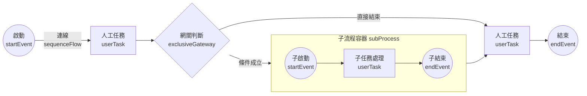

# Flowable - 流程圖 (BPMN)

Flowable 使用 `XML` 來進行 流程圖設計，相關流程圖 要放置於 `/resources/processes/*.bpmn`

## 基礎結構

下面為 BPMN 流程圖 的 基本結構

```xml
<?xml version="1.0" encoding="UTF-8"?>
<definitions 
    xmlns="http://www.omg.org/spec/BPMN/20100524/MODEL"
    xmlns:xsi="http://www.w3.org/2001/XMLSchema-instance"
    xmlns:flowable="http://flowable.org/bpmn"
    xmlns:bpmndi="http://www.omg.org/spec/BPMN/20100524/DI"
    xmlns:omgdc="http://www.omg.org/spec/DD/20100524/DC"
    xmlns:omgdi="http://www.omg.org/spec/DD/20100524/DI"
    targetNamespace="http://www.flowable.org/processdef"
    typeLanguage="http://www.w3.org/2001/XMLSchema"
    expressionLanguage="http://www.w3.org/1999/XPath">
  <process id="myProcess" name="我的流程" isExecutable="true">
    <!-- 流程內容放這裡 -->
  </process>
</definitions>
```

## 流程內容



### 1. 節點

#### startEvent（開始事件）

流程的起點。

```xml
<startEvent id="startEvent" name="開始" />
```

#### userTask（用戶任務）

需要人工操作（例如建檔、審核）。

```xml
<userTask id="task1" name="建檔" flowable:assignee="${assignee}" />
```

**常用屬性：**

| 屬性                         | 說明                |
| -------------------------- | ----------------- |
| `flowable:assignee`        | 指定任務負責人（單一用戶）     |
| `flowable:candidateUsers`  | 候選用戶列表（多個用戶，逗號分隔） |
| `flowable:candidateGroups` | 候選群組列表            |

#### serviceTask（服務任務）

自動執行的任務，通常調用 Java 類別或表達式。

```xml
<serviceTask id="sendEmail" name="發送郵件" 
    flowable:class="com.example.SendEmailTask" />
```

或使用表達式：

```xml
<serviceTask id="calculate" name="計算" 
    flowable:expression="${myService.calculate(variables)}" />
```

#### endEvent（結束事件）

流程的終點。

```xml
<endEvent id="endEvent" name="結束" />
```

### 2. 連線

#### sequenceFlow（順序流）

用來連接 `兩個節點` 的 `流程箭頭`

| 屬性          | 說明            |
| ----------- | ------------- |
| `id`        | 此 flow 的唯一 ID |
| `sourceRef` | 起點節點 ID       |
| `targetRef` | 終點節點 ID       |
| `name`      | 顯示名稱（選填）      |

```xml
<sequenceFlow 
    id="flow1" 
    sourceRef="startEvent" 
    targetRef="task1" 
/>
```

### 3. 決策節點

#### exclusiveGateway（排他網關）

根據條件選擇一條路徑執行（只能選一條）。

```xml
<exclusiveGateway id="gateway1" name="金額判斷" />

<sequenceFlow sourceRef="gateway1" targetRef="highAmountTask">
  <conditionExpression xsi:type="tFormalExpression">
    <![CDATA[${amount > 10000}]]>
  </conditionExpression>
</sequenceFlow>

<sequenceFlow sourceRef="gateway1" targetRef="lowAmountTask">
  <conditionExpression xsi:type="tFormalExpression">
    <![CDATA[${amount <= 10000}]]>
  </conditionExpression>
</sequenceFlow>
```

#### parallelGateway（並行網關）

同時執行多條路徑，所有路徑都必須完成才能繼續。

```xml
<!-- 分支：同時執行多個任務 -->
<parallelGateway id="fork" name="分支" />

<sequenceFlow sourceRef="fork" targetRef="task1" />
<sequenceFlow sourceRef="fork" targetRef="task2" />
<sequenceFlow sourceRef="fork" targetRef="task3" />

<!-- 合併：等待所有任務完成 -->
<parallelGateway id="join" name="合併" />

<sequenceFlow sourceRef="task1" targetRef="join" />
<sequenceFlow sourceRef="task2" targetRef="join" />
<sequenceFlow sourceRef="task3" targetRef="join" />
```

#### inclusiveGateway（包容網關）

可以同時執行多條符合條件的路徑。

```xml
<inclusiveGateway id="inclusiveGateway" name="多條件判斷" />

<sequenceFlow sourceRef="inclusiveGateway" targetRef="notifyManager">
  <conditionExpression xsi:type="tFormalExpression">
    <![CDATA[${amount > 5000}]]>
  </conditionExpression>
</sequenceFlow>

<sequenceFlow sourceRef="inclusiveGateway" targetRef="notifyFinance">
  <conditionExpression xsi:type="tFormalExpression">
    <![CDATA[${requiresApproval == true}]]>
  </conditionExpression>
</sequenceFlow>
```

### 4. 條件表達式（Condition Expression）

條件表達式用於控制流程的分支走向，常用於 `exclusiveGateway` 和 `inclusiveGateway` 的 `sequenceFlow` 中。

#### 4.1 基本語法

```xml
<sequenceFlow sourceRef="gateway" targetRef="task" name="條件名稱">
  <conditionExpression xsi:type="tFormalExpression">
    <![CDATA[${條件表達式}]]>
  </conditionExpression>
</sequenceFlow>
```

#### 4.2 簡單條件判斷

**數值比較：**

```xml
<sequenceFlow sourceRef="gateway" targetRef="highAmountTask" name="高額">
  <conditionExpression xsi:type="tFormalExpression">
    <![CDATA[${amount > 10000}]]>
  </conditionExpression>
</sequenceFlow>
```

**字串比較：**

```xml
<sequenceFlow sourceRef="gateway" targetRef="urgentTask" name="緊急">
  <conditionExpression xsi:type="tFormalExpression">
    <![CDATA[${priority == 'urgent'}]]>
  </conditionExpression>
</sequenceFlow>
```

**布林判斷：**

```xml
<sequenceFlow sourceRef="gateway" targetRef="approveTask" name="需審核">
  <conditionExpression xsi:type="tFormalExpression">
    <![CDATA[${needsApproval == true}]]>
  </conditionExpression>
</sequenceFlow>
```

#### 4.3 複合條件

**AND 條件：**

```xml
<sequenceFlow sourceRef="gateway" targetRef="specialTask">
  <conditionExpression xsi:type="tFormalExpression">
    <![CDATA[${amount > 50000 && department == 'IT'}]]>
  </conditionExpression>
</sequenceFlow>
```

**OR 條件：**

```xml
<sequenceFlow sourceRef="gateway" targetRef="managerTask">
  <conditionExpression xsi:type="tFormalExpression">
    <![CDATA[${amount > 100000 || priority == 'high'}]]>
  </conditionExpression>
</sequenceFlow>
```

**複雜條件：**

```xml
<sequenceFlow sourceRef="gateway" targetRef="ceoTask">
  <conditionExpression xsi:type="tFormalExpression">
    <![CDATA[${(amount > 500000 && department == 'finance') || (amount > 1000000)}]]>
  </conditionExpression>
</sequenceFlow>
```

#### 4.4 使用 Java Method

**調用 Spring Bean 方法：**

```xml
<sequenceFlow sourceRef="gateway" targetRef="approveTask" name="需要審核">
  <conditionExpression xsi:type="tFormalExpression">
    <![CDATA[${approvalService.needsApproval(amount, type)}]]>
  </conditionExpression>
</sequenceFlow>
```

對應的 Java Service：

```java
@Service("approvalService")
public class ApprovalService {

    public boolean needsApproval(Integer amount, String type) {
        // 自定義判斷邏輯
        if ("urgent".equals(type)) {
            return amount > 5000;
        }
        return amount > 10000;
    }
}
```

**使用 Execution 參數：**

```xml
<sequenceFlow sourceRef="gateway" targetRef="task1">
  <conditionExpression xsi:type="tFormalExpression">
    <![CDATA[${myService.checkCondition(execution)}]]>
  </conditionExpression>
</sequenceFlow>
```

```java
@Service("myService")
public class MyService {

    public boolean checkCondition(DelegateExecution execution) {
        // 從 execution 中獲取變數
        Integer amount = (Integer) execution.getVariable("amount");
        String department = (String) execution.getVariable("department");

        // 複雜的業務邏輯判斷
        if ("finance".equals(department)) {
            return amount > 50000;
        }
        return amount > 100000;
    }
}
```

**傳遞多個參數：**

```xml
<sequenceFlow sourceRef="gateway" targetRef="managerTask">
  <conditionExpression xsi:type="tFormalExpression">
    <![CDATA[${approvalService.isHighRisk(amount, days, department)}]]>
  </conditionExpression>
</sequenceFlow>
```

```java
@Service("approvalService")
public class ApprovalService {

    public boolean isHighRisk(Integer amount, Integer days, String department) {
        // 多條件判斷
        if (amount > 50000 && days > 10) {
            return true;
        }

        if ("IT".equals(department) && amount > 20000) {
            return true;
        }

        return false;
    }
}
```

**使用靜態方法：**

```xml
<sequenceFlow sourceRef="gateway" targetRef="task1">
  <conditionExpression xsi:type="tFormalExpression">
    <![CDATA[${T(com.example.util.ValidationUtil).isValid(amount)}]]>
  </conditionExpression>
</sequenceFlow>
```

```java
package com.example.util;

public class ValidationUtil {

    public static boolean isValid(Integer amount) {
        return amount != null && amount > 0 && amount <= 1000000;
    }
}
```

#### 4.5 條件表達式完整範例

```xml
<process id="purchaseProcess" name="採購流程" isExecutable="true">

  <startEvent id="start" />

  <userTask id="submitRequest" name="提交採購申請" 
      flowable:assignee="${requester}" />

  <exclusiveGateway id="amountGateway" name="金額判斷" />

  <!-- 使用 Java 方法判斷 -->
  <sequenceFlow sourceRef="amountGateway" targetRef="ceoApproval" 
      name="需要 CEO 審核">
    <conditionExpression xsi:type="tFormalExpression">
      <![CDATA[${approvalService.needsCEOApproval(amount, category, department)}]]>
    </conditionExpression>
  </sequenceFlow>

  <sequenceFlow sourceRef="amountGateway" targetRef="managerApproval" 
      name="主管審核即可">
    <conditionExpression xsi:type="tFormalExpression">
      <![CDATA[${approvalService.needsManagerApproval(amount, category)}]]>
    </conditionExpression>
  </sequenceFlow>

  <sequenceFlow sourceRef="amountGateway" targetRef="autoApprove" 
      name="自動核准">
    <conditionExpression xsi:type="tFormalExpression">
      <![CDATA[${approvalService.canAutoApprove(amount)}]]>
    </conditionExpression>
  </sequenceFlow>

  <userTask id="ceoApproval" name="CEO 審核" 
      flowable:candidateGroups="ceo" />

  <userTask id="managerApproval" name="主管審核" 
      flowable:assignee="${manager}" />

  <serviceTask id="autoApprove" name="自動核准"
      flowable:expression="${approvalService.autoApprove(execution)}" />

  <endEvent id="end" />

  <sequenceFlow sourceRef="start" targetRef="submitRequest" />
  <sequenceFlow sourceRef="submitRequest" targetRef="amountGateway" />
  <sequenceFlow sourceRef="ceoApproval" targetRef="end" />
  <sequenceFlow sourceRef="managerApproval" targetRef="end" />
  <sequenceFlow sourceRef="autoApprove" targetRef="end" />

</process>
```

對應的完整 Service：

```java
@Service("approvalService")
public class ApprovalService {

    @Autowired
    private PurchaseRepository purchaseRepository;

    /**
     * 判斷是否需要 CEO 審核
     */
    public boolean needsCEOApproval(Integer amount, String category, String department) {
        // 超過 100 萬一律需要 CEO 審核
        if (amount > 1000000) {
            return true;
        }

        // IT 部門超過 50 萬需要 CEO 審核
        if ("IT".equals(department) && amount > 500000) {
            return true;
        }

        // 特殊類別超過 30 萬需要 CEO 審核
        if ("special".equals(category) && amount > 300000) {
            return true;
        }

        return false;
    }

    /**
     * 判斷是否需要主管審核
     */
    public boolean needsManagerApproval(Integer amount, String category) {
        // 金額在 1 萬到 100 萬之間需要主管審核
        if (amount >= 10000 && amount <= 1000000) {
            return true;
        }

        // 一般類別超過 5000 需要主管審核
        if ("normal".equals(category) && amount > 5000) {
            return true;
        }

        return false;
    }

    /**
     * 判斷是否可以自動核准
     */
    public boolean canAutoApprove(Integer amount) {
        // 金額小於 1 萬可以自動核准
        return amount < 10000;
    }

    /**
     * 自動核准處理
     */
    public void autoApprove(DelegateExecution execution) {
        String processInstanceId = execution.getProcessInstanceId();
        Integer amount = (Integer) execution.getVariable("amount");

        // 記錄自動核准
        log.info("自動核准採購申請: {}, 金額: {}", processInstanceId, amount);

        // 設定審核結果
        execution.setVariable("approved", true);
        execution.setVariable("approvedBy", "system");
        execution.setVariable("approvedTime", LocalDateTime.now());
    }
}
```

#### 4.6 注意事項

1. **使用 CDATA**：條件表達式建議使用 `<![CDATA[...]]>` 包裹，避免 XML 解析問題（特別是包含 `<`、`>` 等符號時）
2. **Bean 名稱**：確保 Service 類別有 `@Service` 註解並指定名稱，在表達式中使用該名稱
3. **返回類型**：條件表達式中的方法必須返回 `boolean` 類型
4. **變數存在性**：表達式中使用的變數必須在流程變數中存在，否則會拋出異常
5. **預設路徑**：exclusiveGateway 建議設定一個預設路徑（無條件），避免所有條件都不滿足時流程卡住
6. **異常處理**：Java 方法中的異常會導致流程執行失敗，需要適當處理
7. **性能考量**：避免在條件判斷方法中執行耗時的操作（如複雜的數據庫查詢）

### 5. 子流程

#### subProcess（子流程）

將一組相關的活動組織成一個可重用的單元。

```xml
<subProcess id="subProcess1" name="審核子流程">
  <startEvent id="subStart" />

  <userTask id="subTask1" name="初審" 
      flowable:assignee="${reviewer1}" />

  <userTask id="subTask2" name="複審" 
      flowable:assignee="${reviewer2}" />

  <sequenceFlow sourceRef="subStart" targetRef="subTask1" />
  <sequenceFlow sourceRef="subTask1" targetRef="subTask2" />
  <sequenceFlow sourceRef="subTask2" targetRef="subEnd" />

  <endEvent id="subEnd" />
</subProcess>
```

### 6. 事件類型

#### 計時器事件（Timer Event）

基於時間觸發的事件。

**計時器開始事件：**

```xml
<startEvent id="timerStart">
  <timerEventDefinition>
    <!-- 每天早上 9 點執行 -->
    <timeCycle>0 0 9 * * ?</timeCycle>
  </timerEventDefinition>
</startEvent>
```

**邊界計時器事件（超時處理）：**

```xml
<userTask id="userTask" name="處理任務" />

<boundaryEvent id="timer" attachedToRef="userTask" cancelActivity="true">
  <timerEventDefinition>
    <!-- 3 天後超時 -->
    <timeDuration>P3D</timeDuration>
  </timerEventDefinition>
</boundaryEvent>

<sequenceFlow sourceRef="timer" targetRef="timeoutTask" />
```

#### 訊息事件（Message Event）

接收或發送訊息。

```xml
<intermediateCatchEvent id="waitForMessage" name="等待訊息">
  <messageEventDefinition messageRef="approvalMessage" />
</intermediateCatchEvent>

<message id="approvalMessage" name="ApprovalMessage" />
```

### 7. 完整範例

```xml
<?xml version="1.0" encoding="UTF-8"?>
<definitions xmlns="http://www.omg.org/spec/BPMN/20100524/MODEL"
             xmlns:xsi="http://www.w3.org/2001/XMLSchema-instance"
             xmlns:xsd="http://www.w3.org/2001/XMLSchema"
             xmlns:flowable="http://flowable.org/bpmn"
             targetNamespace="http://flowable.org/bpmn">

    <process id="caseProcess" name="案件流程" isExecutable="true">

        <startEvent id="startEvent"/>
        <sequenceFlow id="flow1" sourceRef="startEvent" targetRef="taskPickup"/>

        <userTask id="taskPickup" name="取件" flowable:assignee="${assignee}"/>
        <sequenceFlow id="flow2" sourceRef="taskPickup" targetRef="taskFiling"/>

        <userTask id="taskFiling" name="建檔" flowable:assignee="${assignee}"/>
        <sequenceFlow id="flow3" sourceRef="taskFiling" targetRef="taskReview"/>

        <userTask id="taskReview" name="審核" flowable:assignee="${assignee}"/>
        <sequenceFlow id="flow4" sourceRef="taskReview" targetRef="gatewayDecision"/>

        <exclusiveGateway id="gatewayDecision" name="審核決策"/>

        <sequenceFlow id="flowPass" sourceRef="gatewayDecision" targetRef="taskApprove">
            <conditionExpression xsi:type="tFormalExpression"><![CDATA[${outcome == 'pass'}]]></conditionExpression>
        </sequenceFlow>

        <sequenceFlow id="flowConsult" sourceRef="gatewayDecision" targetRef="subProcessConsultation">
            <conditionExpression xsi:type="tFormalExpression"><![CDATA[${outcome == 'consult'}]]></conditionExpression>
        </sequenceFlow>

        <subProcess id="subProcessConsultation" name="照會流程">
            <startEvent id="subStart"/>
            <sequenceFlow id="subFlow1" sourceRef="subStart" targetRef="taskConsultUser"/>

            <userTask id="taskConsultUser" name="照會回復" flowable:assignee="${consultAssignee}"/>
            <sequenceFlow id="subFlow2" sourceRef="taskConsultUser" targetRef="subEnd"/>

            <endEvent id="subEnd"/>
        </subProcess>

        <sequenceFlow id="flowReturn" sourceRef="subProcessConsultation" targetRef="taskReview"/>

        <userTask id="taskApprove" name="送核" flowable:assignee="${assignee}"/>
        <sequenceFlow id="flow5" sourceRef="taskApprove" targetRef="taskClose"/>

        <userTask id="taskClose" name="結案" flowable:assignee="${assignee}"/>
        <sequenceFlow id="flow6" sourceRef="taskClose" targetRef="endEvent"/>

        <endEvent id="endEvent"/>

    </process>
</definitions>
```

## 變數使用

在流程中可以使用變數來傳遞資料：

```java
// 啟動流程時設定變數
Map<String, Object> variables = new HashMap<>();
variables.put("employee", "john");
variables.put("days", 3);
variables.put("approved", false);

runtimeService.startProcessInstanceByKey("leaveRequest", variables);
```

在 XML 中使用變數：

```xml
<!-- 使用 ${} 表達式 -->
<userTask id="task" flowable:assignee="${employee}" />

<!-- 條件判斷 -->
<conditionExpression xsi:type="tFormalExpression">
  <![CDATA[${days > 3}]]>
</conditionExpression>
```

## 常用表達式

| 表達式                                | 說明                |
| ---------------------------------- | ----------------- |
| `${variable}`                      | 取得變數值             |
| `${variable > 10}`                 | 條件判斷              |
| `${myService.method()}`            | 調用 Spring Bean 方法 |
| `${execution.getVariable('name')}` | 從執行上下文取得變數        |

## 注意事項

1. **id 必須唯一**：每個元素的 id 在整個流程定義中必須是唯一的
2. **isExecutable 屬性**：process 標籤必須設定 `isExecutable="true"` 才能執行
3. **條件表達式**：使用 CDATA 包裹條件表達式以避免 XML 解析問題
4. **網關必須配對**：並行網關的分支和合併必須成對出現
5. **預設路徑**：exclusiveGateway 建議設定一個預設路徑（無條件）以避免流程卡住