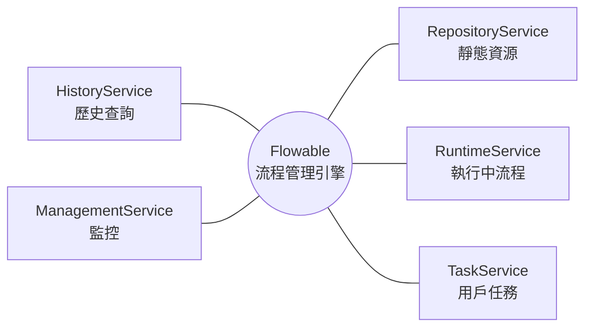

# Flowable - Java Service 的撰寫

本章節詳細說明如何撰寫 Java Service 來控制和操作 Flowable 的 BPMN 流程。

## Flowable 核心 Service 介紹

Flowable 提供了多個核心 Service 來操作流程引擎：



| Service               | 說明                         |
| --------------------- | -------------------------- |
| **RepositoryService** | 管理流程定義、部署、模型               |
| **RuntimeService**    | 管理流程實例的執行、查詢執行中的流程         |
| **TaskService**       | 管理用戶任務（UserTask）的簽收、完成、委派等 |
| **HistoryService**    | 查詢歷史數據（已完成的流程、任務等）         |
| **ManagementService** | 管理和監控引擎（Job、定時器等）          |

## 常用方法

| Service               | 方法                                                                                                                                                                                                                          | 輸入參數                                                                                        | 說明                                |
| --------------------- | --------------------------------------------------------------------------------------------------------------------------------------------------------------------------------------------------------------------------- | ------------------------------------------------------------------------------------------- | --------------------------------- |
| **RepositoryService** | `createDeployment()` <br> → `addClasspathResource(String path)` （加入 classpath 下的 BPMN 資源） <br> → `deploy()` （執行部署）                                                                                                          | `path`（BPMN 路徑, classpath 位置）                                                               | 部署流程（classPath 方式）                |
|                       | `addInputStream(String resourceName, InputStream inputStream)`                                                                                                                                                              | `resourceName`（資源名稱）<br>`inputStream`（BPMN XML InputStream）                                 | 部署流程（InputStream 方式）              |
|                       | `deleteDeployment(String deploymentId, boolean cascade)`                                                                                                                                                                    | `deploymentId`（部署 ID）<br>`cascade`（是否刪除相關流程實例）                                              | 刪除流程部署                            |
|                       | `createProcessDefinitionQuery()`                                                                                                                                                                                            | 無                                                                                           | 查詢流程定義                            |
|                       | `getProcessDiagram(String processDefinitionId)`                                                                                                                                                                             | `processDefinitionId`（流程定義 ID）                                                              | 取得流程圖 InputStream                 |
|                       | `suspendProcessDefinitionById(String id)`                                                                                                                                                                                   | `id`（流程定義 ID）                                                                               | 暫停流程定義                            |
|                       | `activateProcessDefinitionById(String id)`                                                                                                                                                                                  | `id`（流程定義 ID）                                                                               | 激活流程定義                            |
|                       | `getBpmnModel(String processDefinitionId)`                                                                                                                                                                                  | `processDefinitionId`（流程定義 ID）                                                              | 取得 BPMN 模型物件（程式控制用）               |
|                       | `getProcessModel(String processDefinitionId)`                                                                                                                                                                               | `processDefinitionId`（流程定義 ID）                                                              | 取得 BPMN XML InputStream           |
| **RuntimeService**    | `startProcessInstanceByKey(String key)`                                                                                                                                                                                     | `key`（流程 key）                                                                               | 啟動流程實例                            |
|                       | `startProcessInstanceByKey(String key, Map vars)`                                                                                                                                                                           | `key`（流程 key）<br>`vars`（初始流程變數 Map）                                                         | 帶流程變數啟動流程                         |
|                       | `startProcessInstanceById(String defId)`                                                                                                                                                                                    | `defId`（流程定義 ID）                                                                            | 啟動流程實例                            |
|                       | `startProcessInstanceById(String defId, Map vars)`                                                                                                                                                                          | `defId`（流程定義 ID）<br>`vars`（初始流程變數 Map）                                                      | 帶流程變數啟動流程                         |
|                       | `setVariable(String execId, String varName, Object value)`                                                                                                                                                                  | `execId`（流程執行 ID）<br>`varName`（變數名稱）<br>`value`（變數值）                                        | 設定單一流程變數                          |
|                       | `setVariables(String execId, Map vars)`                                                                                                                                                                                     | `execId`（流程執行 ID）<br>`vars`（多個變數 Map）                                                       | 設定多個流程變數                          |
|                       | `getVariable(String execId, String varName)`                                                                                                                                                                                | `execId`（流程執行 ID）<br>`varName`（變數名稱）                                                        | 取得單一流程變數                          |
|                       | `getVariables(String execId)`                                                                                                                                                                                               | `execId`（流程執行 ID）                                                                           | 取得全部流程變數                          |
|                       | `deleteProcessInstance(String processInstanceId, String reason)`                                                                                                                                                            | `processInstanceId`（流程實例 ID）<br>`reason`（刪除原因）                                              | 刪除流程實例                            |
|                       | `createProcessInstanceQuery()`                                                                                                                                                                                              | 無                                                                                           | 查詢流程實例                            |
|                       | `createChangeActivityStateBuilder()` <br> → `processInstanceId(String processInstanceId)` （指定流程實例） <br> → `moveActivityIdTo(String currentActivityId, String targetActivityId)` （從當前節點跳到目標節點） <br> → `changeState()` （執行跳轉） | `processInstanceId`（流程實例 ID）<br>`currentActivityId`（當前節點 ID）<br>`targetActivityId`（目標節點 ID） | 將流程從當前節點跳轉到指定節點，可退回上一關或跳關         |
| **TaskService**       | `createTaskQuery()`                                                                                                                                                                                                         | 無                                                                                           | 查詢任務                              |
|                       | `complete(String taskId)`                                                                                                                                                                                                   | `taskId`（任務 ID）                                                                             | 完成任務                              |
|                       | `complete(String taskId, Map vars)`                                                                                                                                                                                         | `taskId`（任務 ID）<br>`vars`（流程變數 Map）                                                         | 完成任務並寫入流程變數                       |
|                       | `claim(String taskId, String userId)`                                                                                                                                                                                       | `taskId`（任務 ID）<br>`userId`（使用者 ID）                                                         | 簽收任務                              |
|                       | `unclaim(String taskId)`                                                                                                                                                                                                    | `taskId`（任務 ID）                                                                             | 取消簽收                              |
|                       | `setAssignee(String taskId, String userId)`                                                                                                                                                                                 | `taskId`（任務 ID）<br>`userId`（負責人 ID）                                                         | 指派任務負責人                           |
|                       | `delegateTask(String taskId, String userId)`                                                                                                                                                                                | `taskId`（任務 ID）<br>`userId`（受委派使用者 ID）                                                      | 委派任務                              |
|                       | `setOwner(String taskId, String userId)`                                                                                                                                                                                    | `taskId`（任務 ID）<br>`userId`（擁有者 ID）                                                         | 設定任務擁有者                           |
|                       | `setVariable(String taskId, String varName, Object value)`                                                                                                                                                                  | `taskId`（任務 ID）<br>`varName`（變數名稱）<br>`value`（變數值）                                          | 設定任務變數                            |
|                       | `getVariables(String taskId)`                                                                                                                                                                                               | `taskId`（任務 ID）                                                                             | 取得任務變數                            |
| **HistoryService**    | `createHistoricProcessInstanceQuery()`                                                                                                                                                                                      | 無                                                                                           | 查詢歷史流程                            |
|                       | `createHistoricTaskInstanceQuery()`                                                                                                                                                                                         | 無                                                                                           | 查詢歷史任務                            |
|                       | `createHistoricActivityInstanceQuery()`                                                                                                                                                                                     | 無                                                                                           | 查詢歷史活動（含 userTask/網關/ServiceTask） |
|                       | `createHistoricVariableInstanceQuery()`                                                                                                                                                                                     | 無                                                                                           | 查詢歷史變數                            |
|                       | `deleteHistoricProcessInstance(String processInstanceId)`                                                                                                                                                                   | `processInstanceId`（流程實例 ID）                                                                | 刪除歷史流程資料                          |
| **ManagementService** | `createJobQuery()`                                                                                                                                                                                                          | 無                                                                                           | 查詢異步 Job                          |
|                       | `executeJob(String jobId)`                                                                                                                                                                                                  | `jobId`（Job ID）                                                                             | 手動執行 Job                          |
|                       | `deleteJob(String jobId)`                                                                                                                                                                                                   | `jobId`（Job ID）                                                                             | 刪除 Job                            |
|                       | `createTimerJobQuery()`                                                                                                                                                                                                     | 無                                                                                           | 查詢 Timer Job                      |
|                       | `getTableCount()`                                                                                                                                                                                                           | 無                                                                                           | 取得所有 Flowable 表的筆數                |
| **IdentityService**   | `saveUser(User user)`                                                                                                                                                                                                       | `user`（使用者物件）                                                                               | 新增/更新使用者                          |
|                       | `deleteUser(String userId)`                                                                                                                                                                                                 | `userId`（使用者 ID）                                                                            | 刪除使用者                             |
|                       | `createUserQuery()`                                                                                                                                                                                                         | 無                                                                                           | 查詢使用者                             |
|                       | `saveGroup(Group group)`                                                                                                                                                                                                    | `group`（群組物件）                                                                               | 新增/更新群組                           |
|                       | `createGroupQuery()`                                                                                                                                                                                                        | 無                                                                                           | 查詢群組                              |
|                       | `createMembership(String userId, String groupId)`                                                                                                                                                                           | `userId`（使用者 ID）<br>`groupId`（群組 ID）                                                        | 使用者加入群組                           |
| **FormService**       | `getStartFormData(String defId)`                                                                                                                                                                                            | `defId`（流程定義 ID）                                                                            | 取得流程啟動表單                          |
|                       | `submitStartFormData(String defId, Map formData)`                                                                                                                                                                           | `defId`（流程定義 ID）<br>`formData`（表單資料 Map）                                                    | 提交流程啟動表單                          |
|                       | `getTaskFormData(String taskId)`                                                                                                                                                                                            | `taskId`（任務 ID）                                                                             | 取得任務表單                            |
|                       | `submitTaskFormData(String taskId, Map formData)`                                                                                                                                                                           | `taskId`（任務 ID）<br>`formData`（表單資料 Map）                                                     | 提交任務表單                            |

## 範例

### 1. 案件查詢

使用 `RuntimeService` 的 `createProcessInstanceQuery()` 進行案件查詢：

- **processDefinitionKey**: 指定 BPMN 流程的 ID
- **variableValueEquals**: 透過變數名稱與變數值作為查詢條件

```java
package com.mli.flowable.service;

import org.flowable.engine.RuntimeService;
import org.flowable.engine.TaskService;
import org.flowable.engine.runtime.ProcessInstance;
import org.flowable.task.api.Task;
import org.springframework.beans.factory.annotation.Autowired;
import org.springframework.stereotype.Service;
import org.springframework.util.CollectionUtils;

import java.util.HashMap;
import java.util.List;
import java.util.Map;

@Service
public class FlowableCaseQueryService {

    @Autowired
    private RuntimeService runtimeService;

    @Autowired
    private TaskService taskService;

    @Autowired
    private FlowableCaseHistoryService flowableCaseHistoryService;

    /**
     * 查詢案件流程資訊
     * @param caseNo 案件編號
     * @return Map 包含流程實例ID, 狀態, 目前任務資訊
     */
    public Map<String, Object> queryCase(String caseNo) {
        // 先找未結案
        Map<String, Object> output = queryActiveCase(caseNo);

        return output != null ? output : queryCompletedCase(caseNo);
    }

    /**
     * 查詢案件流程資訊 (未結案)
     * @param caseNo 案件編號
     * @return Map 包含流程實例ID, 狀態, 目前任務資訊
     */
    public Map<String, Object> queryActiveCase(String caseNo) {

        // 查詢流程實例（運行中）
        List<ProcessInstance> instances = runtimeService.createProcessInstanceQuery()
                .processDefinitionKey("caseProcess")
                .variableValueEquals("caseNo", caseNo)
                .list();

        if (instances == null || instances.isEmpty()) {
            return null; // 沒有該案件流程
        }

        // 目前只取第一個匹配的流程
        ProcessInstance instance = instances.get(0);

        // 查詢該流程當前任務
        List<Task> tasks = taskService.createTaskQuery()
                .processInstanceId(instance.getId())
                .list();

        // 取得第一筆任務
        Task task = tasks.get(0);

        Map<String, Object> result = new HashMap<>();
        result.put("caseNo", caseNo);
        result.put("processInstanceId", instance.getId());
        result.put("taskId", task.getId());
        result.put("taskName", task.getName());
        result.put("assignee", task.getAssignee());

        return result;
    }

    /**
     * 查詢案件流程資訊 (已結案)
     * @param caseNo 案件編號
     * @return Map 包含流程實例ID、最後任務資訊
     */
    public Map<String, Object> queryCompletedCase(String caseNo) {
        List<Map<String, Object>> completedCaseList = flowableCaseHistoryService.queryCaseFullHistory(caseNo);
        // 案件不存在
        if (CollectionUtils.isEmpty(completedCaseList)) {
            return null;
        }

        // 取得歷史流程 最後一筆
        Map<String, Object> completedCase = completedCaseList.get(completedCaseList.size() - 1);

        Map<String, Object> result = new HashMap<>();
        result.put("caseNo", caseNo);
        result.put("processInstanceId", completedCase.get("processInstanceId"));
        result.put("taskId", "");
        result.put("taskName", completedCase.get("activityName"));
        result.put("assignee", completedCase.get("assignee"));

        return result;
    }
}
```

### 2. 新增案件

使用 `RuntimeService` 的 `startProcessInstanceByKey()` 啟動流程實例：

- 第 1 個參數：BPMN 流程的 ID
- 第 2 個參數：流程變數（`Map<String, Object>`），會保存到 Flowable 的資料表中

```java
package com.mli.flowable.service;

import org.flowable.engine.RuntimeService;
import org.flowable.engine.runtime.ProcessInstance;
import org.springframework.beans.factory.annotation.Autowired;
import org.springframework.stereotype.Service;

import java.util.HashMap;
import java.util.Map;

@Service
public class FlowableCaseCreateService {

    @Autowired
    private RuntimeService runtimeService;

    @Autowired
    private FlowableCaseQueryService caseQueryService;

    /**
     * 新增案件
     * 1. 先查詢 Flowable DB 是否已有相同 caseNo
     * 2. 若不存在 → 啟動流程
     *
     * @param caseNo 案件編號
     * @param assignee 任務負責人
     * @return processInstanceId
     */
    public String createCase(String caseNo, String assignee) {

        // Step 1: 查詢 Flowable DB 是否已存在
        Map<String, Object> existing = caseQueryService.queryActiveCase(caseNo);
        if (existing != null) {
            throw new RuntimeException("案件已存在於流程中, caseNo=" + caseNo);
        }

        // Step 2: 準備流程變數
        Map<String, Object> vars = new HashMap<>();
        vars.put("caseNo", caseNo);
        vars.put("assignee", assignee);        // 任務負責人
        vars.put("outcome", "pass");
        vars.put("consultAssignee", "");

        // Step 3: 啟動流程
        ProcessInstance instance = runtimeService.startProcessInstanceByKey("caseProcess", vars);

        return instance.getId();
    }
}
```

### 3. 送至下一關 / 送至照會

使用 `TaskService` 完成當前任務，讓流程前進到下一個節點：

- 使用 `createTaskQuery()` 配合 `processInstanceId()` 查詢案件當前任務
  - 透過案件查詢取得 `processInstanceId`
  - 無資料代表流程已完成或案件不存在
- 使用 `complete(taskId)` 完成任務，讓流程前進至下一關
- 可透過 `setVariable()` 在完成任務前設定流程變數

```java
package com.mli.flowable.service;

import org.flowable.engine.TaskService;
import org.flowable.task.api.Task;
import org.springframework.beans.factory.annotation.Autowired;
import org.springframework.stereotype.Service;

import java.util.HashMap;
import java.util.List;
import java.util.Map;

@Service
public class FlowableCaseAdvanceService {

    @Autowired
    private TaskService taskService;

    @Autowired
    private FlowableCaseQueryService caseQueryService;

    /**
     * 將案件送至下一關
     *
     * @param caseNo 案件編號
     * @return 下一關任務資訊
     */
    public Map<String, String> advanceCase(String caseNo) {

        // 取得案件資料
        Map<String, Object> caseInfo = caseQueryService.queryActiveCase(caseNo);
        if (caseInfo == null) {
            throw new RuntimeException("案件不存在或流程未啟動, caseNo=" + caseNo);
        }

        String processInstanceId = (String) caseInfo.get("processInstanceId");

        // 判斷案件狀態
        List<Task> currentTasks = taskService.createTaskQuery()
                .processInstanceId(processInstanceId)
                .list();

        if (currentTasks.isEmpty()) {
            throw new RuntimeException("案件已完成或無當前任務, caseNo=" + caseNo);
        }

        Task task = currentTasks.get(0);

        // 若為結束照會，要將 outcome 改回 pass
        if (caseInfo.get("taskName").equals("照會回復")) {
            taskService.setVariable(task.getId(), "outcome", "pass");
        }

        // 完成當前任務
        taskService.complete(task.getId());

        // 取得下一關任務資訊進行回傳
        List<Task> nextTasks = taskService.createTaskQuery()
                .processInstanceId(processInstanceId)
                .list();

        Task nextTask = nextTasks.get(0);

        Map<String, String> nextData = new HashMap<>();
        nextData.put("taskId", nextTask.getId());
        nextData.put("taskName", nextTask.getName());
        nextData.put("assignee", nextTask.getAssignee());
        nextData.put("processInstanceId", nextTask.getProcessInstanceId());

        return nextData;
    }

    /**
     * 送至照會
     *
     * @param caseNo 案件編號
     * @return 下一關任務資訊
     */
    public Map<String, String> toConsult(String caseNo) {

        // 取得案件資料
        Map<String, Object> caseInfo = caseQueryService.queryActiveCase(caseNo);
        if (caseInfo == null) {
            throw new RuntimeException("案件不存在或流程未啟動, caseNo=" + caseNo);
        }

        // 不是審核關卡就離開
        if (!caseInfo.get("taskName").equals("審核")) {
            throw new RuntimeException("非審核不可進行照會, caseNo=" + caseNo);
        }

        // 取得當前任務
        String processInstanceId = (String) caseInfo.get("processInstanceId");
        Task task = taskService.createTaskQuery()
                .processInstanceId(processInstanceId)
                .singleResult();

        // 調整 outcome 為 consult
        taskService.setVariable(task.getId(), "outcome", "consult");

        return advanceCase(caseNo);
    }

}
```

### 4. 返回上一關

透過任務跳轉的方式讓流程返回到上一個節點：

- 使用 `createTaskQuery()` 配合 `processInstanceId()` 查詢案件當前任務
  - 透過案件查詢取得 `processInstanceId`
  - 無資料代表流程已完成或案件不存在
- 使用 `createChangeActivityStateBuilder()` 改變任務節點位置
  - `processInstanceId()`：指定要操作的流程實例 ID
  - `moveActivityIdTo()`：指定從哪個節點跳轉到哪個節點
  - `changeState()`：執行節點跳轉
- 需要自行實作方法來取得上一個節點的 ID

```java
package com.mli.flowable.service;

import org.flowable.engine.RuntimeService;
import org.flowable.engine.TaskService;
import org.flowable.task.api.Task;
import org.springframework.beans.factory.annotation.Autowired;
import org.springframework.stereotype.Service;

import java.util.List;
import java.util.Map;
import java.util.stream.Collectors;

@Service
public class FlowableCaseRollbackService {

    @Autowired
    private TaskService taskService;

    @Autowired
    private RuntimeService runtimeService;

    @Autowired
    private FlowableCaseQueryService caseQueryService;

    /**
     * 將案件返回上一關
     *
     * @param caseNo 案件編號
     * @return 返回後的當前任務資訊列表
     */
    public List<Map<String, String>> rollbackCase(String caseNo) {

        // Step 1: 查詢流程實例
        var caseInfo = caseQueryService.queryActiveCase(caseNo);
        if (caseInfo == null) {
            throw new RuntimeException("案件不存在或流程未啟動, caseNo=" + caseNo);
        }

        String processInstanceId = (String) caseInfo.get("processInstanceId");

        // Step 2: 查詢當前任務
        List<Task> currentTasks = taskService.createTaskQuery()
                .processInstanceId(processInstanceId)
                .list();

        if (currentTasks.isEmpty()) {
            throw new RuntimeException("案件已完成或無當前任務, caseNo=" + caseNo);
        }

        // Step 3: 假設只有一個當前任務，將流程退回上一個節點
        Task currentTask = currentTasks.get(0);

        // Step 4: 使用 runtimeService 改變活動節點
        runtimeService.createChangeActivityStateBuilder()
                .processInstanceId(processInstanceId)
                .moveActivityIdTo(currentTask.getTaskDefinitionKey(), getPreviousActivityId(currentTask))
                .changeState();

        // Step 5: 取得返回後的任務資訊進行回傳
        List<Task> newCurrentTasks = taskService.createTaskQuery()
                .processInstanceId(processInstanceId)
                .list();

        return newCurrentTasks.stream().map(t -> Map.of(
                "taskId", t.getId(),
                "taskName", t.getName(),
                "assignee", t.getAssignee()
        )).collect(Collectors.toList());
    }

    /**
     * 取得上一個活動節點 ID
     * 這裡為簡單示例，實務上可能需要透過 BPMN Model 查找 sequenceFlow
     */
    private String getPreviousActivityId(Task task) {
        // TODO: 根據你的 BPMN 設計返回正確的前置任務 ID
        // 例如 taskFiling -> taskPickup, taskReview -> taskFiling
        switch (task.getTaskDefinitionKey()) {
            case "taskFiling": return "taskPickup";
            case "taskReview": return "taskFiling";
            case "taskApprove": return "taskReview";
            case "taskClose": return "taskApprove";
            default: throw new RuntimeException("無法退回，未知任務: " + task.getTaskDefinitionKey());
        }
    }
}
```

### 5. 查詢案件完整歷史

使用 `HistoryService` 查詢流程的完整歷史記錄：

- 透過案件查詢取得 `processInstanceId`
- 使用 `createHistoricProcessInstanceQuery()` 查詢歷史流程實例
  - `processDefinitionKey()`：指定流程定義的 key
  - `variableValueEquals()`：透過變數作為查詢條件
- 使用 `createHistoricActivityInstanceQuery()` 查詢該流程的所有歷史活動節點
  - `processInstanceId()`：指定流程實例 ID
  - `orderByHistoricActivityInstanceStartTime().asc()`：按開始時間升序排列

```java
package com.mli.flowable.service;

import org.flowable.engine.HistoryService;
import org.flowable.engine.history.HistoricActivityInstance;
import org.flowable.engine.history.HistoricProcessInstance;
import org.springframework.beans.factory.annotation.Autowired;
import org.springframework.stereotype.Service;

import java.util.HashMap;
import java.util.List;
import java.util.Map;
import java.util.stream.Collectors;

@Service
public class FlowableCaseHistoryService {

    @Autowired
    private HistoryService historyService;

    /**
     * 查詢案件完整歷史
     *
     * @param caseNo 案件編號
     * @return List<Map> 每筆 Map 包含節點ID、節點名稱、負責人、開始/結束時間、流程實例ID
     */
    public List<Map<String, Object>> queryCaseFullHistory(String caseNo) {

        // 查詢歷史流程
        List<HistoricProcessInstance> historicInstances = historyService.createHistoricProcessInstanceQuery()
                .processDefinitionKey("caseProcess")
                .variableValueEquals("caseNo", caseNo)
                .orderByProcessInstanceStartTime()
                .asc()
                .list();

        // 遍歷每個流程實例
        return historicInstances.stream().flatMap(instance -> {

            // 查詢每個流程實例的所有活動節點歷史
            List<HistoricActivityInstance> activities = historyService.createHistoricActivityInstanceQuery()
                    .processInstanceId(instance.getId())
                    .orderByHistoricActivityInstanceStartTime()
                    .asc()
                    .list();

            // 將每個節點轉為 Map，並過濾掉不需要的節點類型
            return activities.stream()
                    .filter(act -> !act.getActivityId().matches("flow.*"))          // 排除連線
                    .filter(act -> !act.getActivityId().matches(".*Event"))         // 排除起點與終點
                    .filter(act -> !act.getActivityId().matches("gateway.*"))       // 排除決策節點
                    .filter(act -> !act.getActivityId().matches("subProcess.*"))    // 排除子流程 subProcess
                    .filter(act -> act.getActivityName() != null)
                    .map(act -> {
                        Map<String, Object> map = new HashMap<>();
                        map.put("processInstanceId", act.getProcessInstanceId());
                        map.put("activityName", act.getActivityName());
                        map.put("assignee", act.getAssignee());   // 任務負責人
                        map.put("startTime", act.getStartTime());
                        map.put("endTime", act.getEndTime());
                        return map;
                    });

        }).collect(Collectors.toList());
    }
}
```