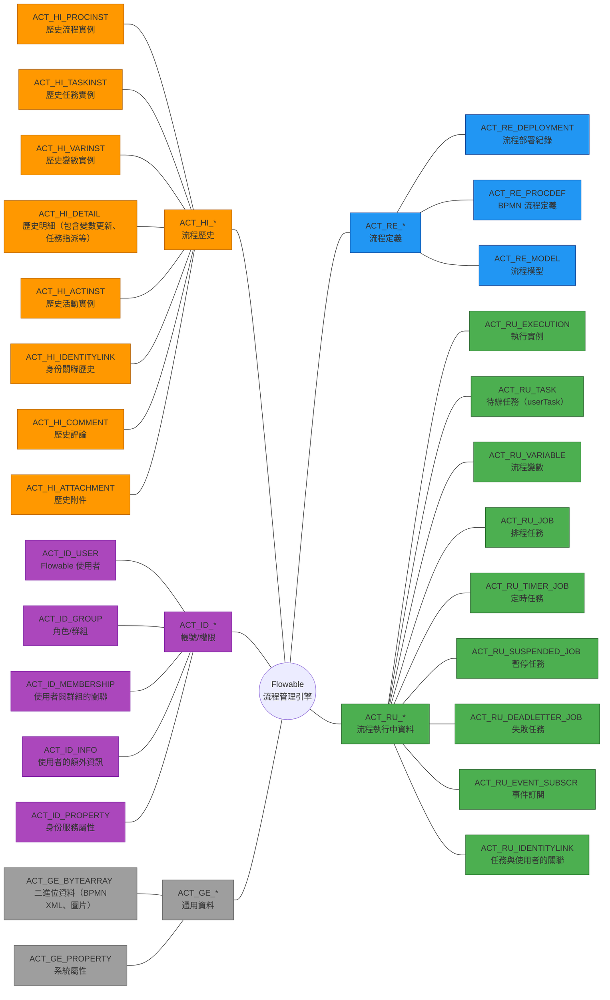

# Flowable - 資料表



Flowable 的資料表，主要有以下幾個模組：

- **ACT_RE_***（Repository：流程定義）
- **ACT_RU_***（Runtime：流程執行中資料）
- **ACT_HI_***（History：流程歷史）
- **ACT_ID_***（Identity：帳號/權限）
- **ACT_GE_***（General：通用資料，如 byte arrays）

## 1. Repository（流程定義相關表） `ACT_RE_*`

這些表儲存 **流程模型、流程定義、表單定義** 等靜態資料。

| Table                 | 說明                                |
| --------------------- | --------------------------------- |
| **ACT_RE_DEPLOYMENT** | 流程部署紀錄（一次部署一筆）                    |
| **ACT_RE_PROCDEF**    | BPMN 流程定義（對應 processDefinitionId） |
| **ACT_RE_MODEL**      | 流程模型（BPMN/表單/DMN）                 |

<details>
<summary>ACT_RE_DEPLOYMENT（流程部署紀錄） - 欄位說明（點擊展開）</summary>

| 欄位                    | 類型        | 說明           |
| --------------------- | --------- | ------------ |
| ID_                   | VARCHAR   | 部署 ID（主鍵）    |
| NAME_                 | VARCHAR   | 部署名稱         |
| CATEGORY_             | VARCHAR   | 部署類別         |
| KEY_                  | VARCHAR   | 部署 Key       |
| TENANT_ID_            | VARCHAR   | 租戶 ID（多租戶使用） |
| DEPLOY_TIME_          | TIMESTAMP | 部署時間         |
| DERIVED_FROM_         | VARCHAR   | 衍生來源         |
| DERIVED_FROM_ROOT_    | VARCHAR   | 根來源          |
| PARENT_DEPLOYMENT_ID_ | VARCHAR   | 父部署 ID       |
| ENGINE_VERSION_       | VARCHAR   | 引擎版本         |

**範例查詢：**

```sql
-- 查詢所有部署記錄
SELECT ID_, NAME_, DEPLOY_TIME_ 
FROM ACT_RE_DEPLOYMENT 
ORDER BY DEPLOY_TIME_ DESC;
```

</details>

<details>
<summary>ACT_RE_PROCDEF（BPMN 流程定義） - 欄位說明（點擊展開）</summary>

| 欄位                      | 類型      | 說明                                   |
| ----------------------- | ------- | ------------------------------------ |
| ID_                     | VARCHAR | 流程定義 ID（主鍵，格式：key:version:generated） |
| REV_                    | INTEGER | 樂觀鎖版本號                               |
| CATEGORY_               | VARCHAR | 流程類別                                 |
| NAME_                   | VARCHAR | 流程名稱                                 |
| KEY_                    | VARCHAR | 流程定義 Key（對應 BPMN 中的 process id）      |
| VERSION_                | INTEGER | 版本號（同 Key 的流程，版本號遞增）                 |
| DEPLOYMENT_ID_          | VARCHAR | 部署 ID（外鍵指向 ACT_RE_DEPLOYMENT）        |
| RESOURCE_NAME_          | VARCHAR | BPMN 檔案名稱                            |
| DGRM_RESOURCE_NAME_     | VARCHAR | 流程圖檔案名稱（PNG）                         |
| DESCRIPTION_            | VARCHAR | 描述                                   |
| HAS_START_FORM_KEY_     | BOOLEAN | 是否有啟動表單                              |
| HAS_GRAPHICAL_NOTATION_ | BOOLEAN | 是否有圖形化標記                             |
| SUSPENSION_STATE_       | INTEGER | 暫停狀態（1=啟用, 2=暫停）                     |
| TENANT_ID_              | VARCHAR | 租戶 ID                                |
| ENGINE_VERSION_         | VARCHAR | 引擎版本                                 |

**範例查詢：**

```sql
-- 查詢最新版本的流程定義
SELECT KEY_, NAME_, VERSION_, DEPLOYMENT_ID_
FROM ACT_RE_PROCDEF
WHERE VERSION_ = (
    SELECT MAX(VERSION_) 
    FROM ACT_RE_PROCDEF p2 
    WHERE p2.KEY_ = ACT_RE_PROCDEF.KEY_
);
```

</details>

<details>
<summary>ACT_RE_MODEL（流程模型） - 欄位說明（點擊展開）</summary>

| 欄位                            | 類型        | 說明           |
| ----------------------------- | --------- | ------------ |
| ID_                           | VARCHAR   | 模型 ID（主鍵）    |
| REV_                          | INTEGER   | 版本號          |
| NAME_                         | VARCHAR   | 模型名稱         |
| KEY_                          | VARCHAR   | 模型 Key       |
| CATEGORY_                     | VARCHAR   | 模型類別         |
| CREATE_TIME_                  | TIMESTAMP | 建立時間         |
| LAST_UPDATE_TIME_             | TIMESTAMP | 最後更新時間       |
| VERSION_                      | INTEGER   | 模型版本         |
| META_INFO_                    | VARCHAR   | 元資料（JSON 格式） |
| DEPLOYMENT_ID_                | VARCHAR   | 部署 ID        |
| EDITOR_SOURCE_VALUE_ID_       | VARCHAR   | 編輯器原始檔 ID    |
| EDITOR_SOURCE_EXTRA_VALUE_ID_ | VARCHAR   | 編輯器額外資料 ID   |
| TENANT_ID_                    | VARCHAR   | 租戶 ID        |

</details>

## 2. Runtime（流程執行中資料） `ACT_RU_*`

只會儲存 **正在執行中的流程**，流程完成後資料會搬到 `ACT_HI_*`。

| Table                     | 說明                                 |
| ------------------------- | ---------------------------------- |
| **ACT_RU_EXECUTION**      | 執行實例（Process Instance / Execution） |
| **ACT_RU_TASK**           | 待辦任務（userTask）                     |
| **ACT_RU_VARIABLE**       | 流程變數（目前流程 instance 與 task 綁的變數）    |
| **ACT_RU_JOB**            | 排程任務（含定時 StartEvent、失敗任務）          |
| **ACT_RU_TIMER_JOB**      | 定時任務                               |
| **ACT_RU_SUSPENDED_JOB**  | 暫停任務                               |
| **ACT_RU_DEADLETTER_JOB** | 失敗任務                               |
| **ACT_RU_EVENT_SUBSCR**   | 事件訂閱（Message / Signal）             |
| **ACT_RU_IDENTITYLINK**   | 任務與使用者的關聯（候選人/代理人/角色）              |

<details>
<summary>ACT_RU_EXECUTION（執行實例） - 欄位說明（點擊展開）</summary>

| 欄位                    | 類型        | 說明                    |
| --------------------- | --------- | --------------------- |
| ID_                   | VARCHAR   | 執行 ID（主鍵）             |
| REV_                  | INTEGER   | 版本號                   |
| PROC_INST_ID_         | VARCHAR   | 流程實例 ID               |
| BUSINESS_KEY_         | VARCHAR   | 業務主鍵（用於關聯業務資料）        |
| PARENT_ID_            | VARCHAR   | 父執行 ID                |
| PROC_DEF_ID_          | VARCHAR   | 流程定義 ID               |
| SUPER_EXEC_           | VARCHAR   | 父流程執行 ID              |
| ROOT_PROC_INST_ID_    | VARCHAR   | 根流程實例 ID              |
| ACT_ID_               | VARCHAR   | 當前活動 ID（BPMN 中的節點 ID） |
| IS_ACTIVE_            | BOOLEAN   | 是否活躍                  |
| IS_CONCURRENT_        | BOOLEAN   | 是否並行                  |
| IS_SCOPE_             | BOOLEAN   | 是否為作用域                |
| IS_EVENT_SCOPE_       | BOOLEAN   | 是否為事件作用域              |
| IS_MI_ROOT_           | BOOLEAN   | 是否為多實例根               |
| SUSPENSION_STATE_     | INTEGER   | 暫停狀態                  |
| TENANT_ID_            | VARCHAR   | 租戶 ID                 |
| NAME_                 | VARCHAR   | 執行名稱                  |
| START_ACT_ID_         | VARCHAR   | 開始活動 ID               |
| START_TIME_           | TIMESTAMP | 開始時間                  |
| START_USER_ID_        | VARCHAR   | 發起人 ID                |
| LOCK_TIME_            | TIMESTAMP | 鎖定時間                  |
| IS_COUNT_ENABLED_     | BOOLEAN   | 是否啟用計數                |
| EVT_SUBSCR_COUNT_     | INTEGER   | 事件訂閱數量                |
| TASK_COUNT_           | INTEGER   | 任務數量                  |
| JOB_COUNT_            | INTEGER   | 任務數量                  |
| TIMER_JOB_COUNT_      | INTEGER   | 定時任務數量                |
| SUSP_JOB_COUNT_       | INTEGER   | 暫停任務數量                |
| DEADLETTER_JOB_COUNT_ | INTEGER   | 死信任務數量                |
| VAR_COUNT_            | INTEGER   | 變數數量                  |
| ID_LINK_COUNT_        | INTEGER   | 身份連結數量                |

**範例查詢：**

```sql
-- 查詢執行中的流程實例
SELECT PROC_INST_ID_, BUSINESS_KEY_, ACT_ID_, START_TIME_
FROM ACT_RU_EXECUTION
WHERE PARENT_ID_ IS NULL  -- 只查主流程
ORDER BY START_TIME_ DESC;
```

</details>

<details>
<summary>ACT_RU_TASK（待辦任務） - 欄位說明（點擊展開）</summary>

| 欄位                   | 類型        | 說明                            |
| -------------------- | --------- | ----------------------------- |
| ID_                  | VARCHAR   | 任務 ID（主鍵）                     |
| REV_                 | INTEGER   | 版本號                           |
| EXECUTION_ID_        | VARCHAR   | 執行 ID                         |
| PROC_INST_ID_        | VARCHAR   | 流程實例 ID                       |
| PROC_DEF_ID_         | VARCHAR   | 流程定義 ID                       |
| TASK_DEF_ID_         | VARCHAR   | 任務定義 ID                       |
| SCOPE_ID_            | VARCHAR   | 作用域 ID                        |
| SUB_SCOPE_ID_        | VARCHAR   | 子作用域 ID                       |
| SCOPE_TYPE_          | VARCHAR   | 作用域類型                         |
| SCOPE_DEFINITION_ID_ | VARCHAR   | 作用域定義 ID                      |
| NAME_                | VARCHAR   | 任務名稱                          |
| PARENT_TASK_ID_      | VARCHAR   | 父任務 ID                        |
| DESCRIPTION_         | VARCHAR   | 任務描述                          |
| TASK_DEF_KEY_        | VARCHAR   | 任務定義 Key（BPMN 中的 userTask id） |
| OWNER_               | VARCHAR   | 任務擁有者                         |
| ASSIGNEE_            | VARCHAR   | 任務處理人                         |
| DELEGATION_          | VARCHAR   | 委派狀態                          |
| PRIORITY_            | INTEGER   | 優先級（預設 50）                    |
| CREATE_TIME_         | TIMESTAMP | 建立時間                          |
| DUE_DATE_            | TIMESTAMP | 到期時間                          |
| CATEGORY_            | VARCHAR   | 類別                            |
| SUSPENSION_STATE_    | INTEGER   | 暫停狀態                          |
| TENANT_ID_           | VARCHAR   | 租戶 ID                         |
| FORM_KEY_            | VARCHAR   | 表單 Key                        |
| CLAIM_TIME_          | TIMESTAMP | 簽收時間                          |
| IS_COUNT_ENABLED_    | BOOLEAN   | 是否啟用計數                        |
| VAR_COUNT_           | INTEGER   | 變數數量                          |
| ID_LINK_COUNT_       | INTEGER   | 身份連結數量                        |
| SUB_TASK_COUNT_      | INTEGER   | 子任務數量                         |

**範例查詢：**

```sql
-- 查詢某用戶的待辦任務
SELECT ID_, NAME_, CREATE_TIME_, PROC_INST_ID_
FROM ACT_RU_TASK
WHERE ASSIGNEE_ = 'user123'
ORDER BY CREATE_TIME_ DESC;

-- 查詢候選任務（需結合 ACT_RU_IDENTITYLINK）
SELECT t.ID_, t.NAME_, t.CREATE_TIME_
FROM ACT_RU_TASK t
INNER JOIN ACT_RU_IDENTITYLINK i ON t.ID_ = i.TASK_ID_
WHERE i.USER_ID_ = 'user123' AND i.TYPE_ = 'candidate';
```

</details>

<details>
<summary>ACT_RU_VARIABLE（流程變數） - 欄位說明（點擊展開）</summary>

| 欄位            | 類型      | 說明                                                      |
| ------------- | ------- | ------------------------------------------------------- |
| ID_           | VARCHAR | 變數 ID（主鍵）                                               |
| REV_          | INTEGER | 版本號                                                     |
| TYPE_         | VARCHAR | 變數類型（string, long, double, boolean, date, serializable） |
| NAME_         | VARCHAR | 變數名稱                                                    |
| EXECUTION_ID_ | VARCHAR | 執行 ID                                                   |
| PROC_INST_ID_ | VARCHAR | 流程實例 ID                                                 |
| TASK_ID_      | VARCHAR | 任務 ID                                                   |
| SCOPE_ID_     | VARCHAR | 作用域 ID                                                  |
| SUB_SCOPE_ID_ | VARCHAR | 子作用域 ID                                                 |
| SCOPE_TYPE_   | VARCHAR | 作用域類型                                                   |
| BYTEARRAY_ID_ | VARCHAR | 二進位資料 ID（大型資料存在 ACT_GE_BYTEARRAY）                       |
| DOUBLE_       | DOUBLE  | Double 值                                                |
| LONG_         | BIGINT  | Long 值                                                  |
| TEXT_         | VARCHAR | 文字值（小於 4000 字元）                                         |
| TEXT2_        | VARCHAR | 額外文字欄位                                                  |

**範例查詢：**

```sql
-- 查詢流程實例的所有變數
SELECT NAME_, TYPE_, TEXT_, LONG_, DOUBLE_
FROM ACT_RU_VARIABLE
WHERE PROC_INST_ID_ = 'process-instance-id';
```

</details>

<details>
<summary>ACT_RU_JOB（排程任務） - 欄位說明（點擊展開）</summary>

| 欄位                   | 類型        | 說明        |
| -------------------- | --------- | --------- |
| ID_                  | VARCHAR   | 任務 ID（主鍵） |
| REV_                 | INTEGER   | 版本號       |
| TYPE_                | VARCHAR   | 任務類型      |
| LOCK_EXP_TIME_       | TIMESTAMP | 鎖定過期時間    |
| LOCK_OWNER_          | VARCHAR   | 鎖定擁有者     |
| EXCLUSIVE_           | BOOLEAN   | 是否獨占      |
| EXECUTION_ID_        | VARCHAR   | 執行 ID     |
| PROCESS_INSTANCE_ID_ | VARCHAR   | 流程實例 ID   |
| PROC_DEF_ID_         | VARCHAR   | 流程定義 ID   |
| ELEMENT_ID_          | VARCHAR   | 元素 ID     |
| ELEMENT_NAME_        | VARCHAR   | 元素名稱      |
| SCOPE_ID_            | VARCHAR   | 作用域 ID    |
| SUB_SCOPE_ID_        | VARCHAR   | 子作用域 ID   |
| SCOPE_TYPE_          | VARCHAR   | 作用域類型     |
| SCOPE_DEFINITION_ID_ | VARCHAR   | 作用域定義 ID  |
| RETRIES_             | INTEGER   | 重試次數      |
| EXCEPTION_STACK_ID_  | VARCHAR   | 異常堆疊 ID   |
| EXCEPTION_MSG_       | VARCHAR   | 異常訊息      |
| DUEDATE_             | TIMESTAMP | 到期時間      |
| REPEAT_              | VARCHAR   | 重複執行設定    |
| HANDLER_TYPE_        | VARCHAR   | 處理器類型     |
| HANDLER_CFG_         | VARCHAR   | 處理器配置     |
| CUSTOM_VALUES_ID_    | VARCHAR   | 自訂值 ID    |
| CREATE_TIME_         | TIMESTAMP | 建立時間      |
| TENANT_ID_           | VARCHAR   | 租戶 ID     |

</details>

<details>
<summary>ACT_RU_TIMER_JOB（定時任務） - 欄位說明（點擊展開）</summary>

| 欄位                   | 類型        | 說明              |
| -------------------- | --------- | --------------- |
| ID_                  | VARCHAR   | 任務 ID（主鍵）       |
| REV_                 | INTEGER   | 版本號             |
| TYPE_                | VARCHAR   | 任務類型（timer）     |
| LOCK_EXP_TIME_       | TIMESTAMP | 鎖定到期時間          |
| LOCK_OWNER_          | VARCHAR   | 鎖定者             |
| EXCLUSIVE_           | BOOLEAN   | 是否獨占            |
| EXECUTION_ID_        | VARCHAR   | 執行 ID           |
| PROCESS_INSTANCE_ID_ | VARCHAR   | 流程實例 ID         |
| PROC_DEF_ID_         | VARCHAR   | 流程定義 ID         |
| ELEMENT_ID_          | VARCHAR   | BPMN 元件 ID      |
| ELEMENT_NAME_        | VARCHAR   | BPMN 元件名稱       |
| SCOPE_ID_            | VARCHAR   | 作用域 ID          |
| SUB_SCOPE_ID_        | VARCHAR   | 子作用域 ID         |
| SCOPE_TYPE_          | VARCHAR   | 作用域類型           |
| SCOPE_DEFINITION_ID_ | VARCHAR   | 作用域定義 ID        |
| RETRIES_             | INTEGER   | 重試次數            |
| EXCEPTION_STACK_ID_  | VARCHAR   | 異常堆疊 ID         |
| EXCEPTION_MSG_       | VARCHAR   | 異常訊息            |
| DUEDATE_             | TIMESTAMP | 下次執行時間          |
| REPEAT_              | VARCHAR   | 重複設定（R3/PT10M…） |
| HANDLER_TYPE_        | VARCHAR   | 處理器             |
| HANDLER_CFG_         | VARCHAR   | 處理器設定           |
| CUSTOM_VALUES_ID_    | VARCHAR   | 自訂資料            |
| CREATE_TIME_         | TIMESTAMP | 建立時間            |
| TENANT_ID_           | VARCHAR   | 租戶 ID           |

</details>

<details>
<summary>ACT_RU_SUSPENDED_JOB（暫停任務） - 欄位說明（點擊展開）</summary>

| 欄位                   | 類型        | 說明         |
| -------------------- | --------- | ---------- |
| ID_                  | VARCHAR   | 任務 ID（主鍵）  |
| REV_                 | INTEGER   | 版本號        |
| TYPE_                | VARCHAR   | 任務類型       |
| LOCK_EXP_TIME_       | TIMESTAMP | 鎖定時間       |
| LOCK_OWNER_          | VARCHAR   | 鎖定者        |
| EXCLUSIVE_           | BOOLEAN   | 是否獨占       |
| EXECUTION_ID_        | VARCHAR   | 執行 ID      |
| PROCESS_INSTANCE_ID_ | VARCHAR   | 流程實例 ID    |
| PROC_DEF_ID_         | VARCHAR   | 流程定義 ID    |
| ELEMENT_ID_          | VARCHAR   | BPMN 元件 ID |
| ELEMENT_NAME_        | VARCHAR   | BPMN 元件名稱  |
| SCOPE_ID_            | VARCHAR   | 作用域 ID     |
| SUB_SCOPE_ID_        | VARCHAR   | 子作用域 ID    |
| SCOPE_TYPE_          | VARCHAR   | 作用域類型      |
| SCOPE_DEFINITION_ID_ | VARCHAR   | 作用域定義 ID   |
| RETRIES_             | INTEGER   | 重試次數       |
| EXCEPTION_STACK_ID_  | VARCHAR   | 異常堆疊       |
| EXCEPTION_MSG_       | VARCHAR   | 異常訊息       |
| DUEDATE_             | TIMESTAMP | 原到期時間      |
| REPEAT_              | VARCHAR   | 重複設定       |
| HANDLER_TYPE_        | VARCHAR   | 處理器        |
| HANDLER_CFG_         | VARCHAR   | 處理器設定      |
| CUSTOM_VALUES_ID_    | VARCHAR   | 自訂資料       |
| CREATE_TIME_         | TIMESTAMP | 建立時間       |
| TENANT_ID_           | VARCHAR   | 租戶 ID      |

</details>

<details>
<summary>ACT_RU_DEADLETTER_JOB（失敗任務） - 欄位說明（點擊展開）</summary>

| 欄位                   | 類型        | 說明         |
| -------------------- | --------- | ---------- |
| ID_                  | VARCHAR   | 任務 ID（主鍵）  |
| REV_                 | INTEGER   | 版本號        |
| TYPE_                | VARCHAR   | 任務類型       |
| LOCK_EXP_TIME_       | TIMESTAMP | 鎖定時間       |
| LOCK_OWNER_          | VARCHAR   | 鎖定者        |
| EXCLUSIVE_           | BOOLEAN   | 是否獨占       |
| EXECUTION_ID_        | VARCHAR   | 執行 ID      |
| PROCESS_INSTANCE_ID_ | VARCHAR   | 流程實例 ID    |
| PROC_DEF_ID_         | VARCHAR   | 流程定義 ID    |
| ELEMENT_ID_          | VARCHAR   | BPMN 元件 ID |
| ELEMENT_NAME_        | VARCHAR   | BPMN 元件名稱  |
| SCOPE_ID_            | VARCHAR   | 作用域 ID     |
| SUB_SCOPE_ID_        | VARCHAR   | 子作用域 ID    |
| SCOPE_TYPE_          | VARCHAR   | 作用域類型      |
| SCOPE_DEFINITION_ID_ | VARCHAR   | 作用域定義 ID   |
| RETRIES_             | INTEGER   | 重試次數       |
| EXCEPTION_STACK_ID_  | VARCHAR   | 異常堆疊       |
| EXCEPTION_MSG_       | VARCHAR   | 異常訊息       |
| DUEDATE_             | TIMESTAMP | 原到期時間      |
| REPEAT_              | VARCHAR   | 重複設定       |
| HANDLER_TYPE_        | VARCHAR   | 處理器        |
| HANDLER_CFG_         | VARCHAR   | 處理器設定      |
| CUSTOM_VALUES_ID_    | VARCHAR   | 自訂資料       |
| CREATE_TIME_         | TIMESTAMP | 建立時間       |
| TENANT_ID_           | VARCHAR   | 租戶 ID      |

</details>

<details>
<summary>ACT_RU_EVENT_SUBSCR（事件訂閱） - 欄位說明（點擊展開）</summary>

| 欄位                   | 類型        | 說明                    |
| -------------------- | --------- | --------------------- |
| ID_                  | VARCHAR   | 訂閱 ID（主鍵）             |
| REV_                 | INTEGER   | 版本號                   |
| EVENT_TYPE_          | VARCHAR   | 事件類型（message, signal） |
| EVENT_NAME_          | VARCHAR   | 事件名稱                  |
| EXECUTION_ID_        | VARCHAR   | 執行 ID                 |
| PROC_INST_ID_        | VARCHAR   | 流程實例 ID               |
| ACTIVITY_ID_         | VARCHAR   | 活動 ID                 |
| CONFIGURATION_       | VARCHAR   | 配置                    |
| CREATED_             | TIMESTAMP | 建立時間                  |
| PROC_DEF_ID_         | VARCHAR   | 流程定義 ID               |
| SUB_SCOPE_ID_        | VARCHAR   | 子作用域 ID               |
| SCOPE_ID_            | VARCHAR   | 作用域 ID                |
| SCOPE_DEFINITION_ID_ | VARCHAR   | 作用域定義 ID              |
| SCOPE_TYPE_          | VARCHAR   | 作用域類型                 |
| TENANT_ID_           | VARCHAR   | 租戶 ID                 |

</details>

<details>
<summary>ACT_RU_IDENTITYLINK（身份關聯） - 欄位說明（點擊展開）</summary>

| 欄位                   | 類型      | 說明                                                     |
| -------------------- | ------- | ------------------------------------------------------ |
| ID_                  | VARCHAR | 關聯 ID（主鍵）                                              |
| REV_                 | INTEGER | 版本號                                                    |
| GROUP_ID_            | VARCHAR | 群組 ID                                                  |
| TYPE_                | VARCHAR | 關聯類型（candidate, assignee, owner, participant, starter） |
| USER_ID_             | VARCHAR | 用戶 ID                                                  |
| TASK_ID_             | VARCHAR | 任務 ID                                                  |
| PROC_INST_ID_        | VARCHAR | 流程實例 ID                                                |
| PROC_DEF_ID_         | VARCHAR | 流程定義 ID                                                |
| SCOPE_ID_            | VARCHAR | 作用域 ID                                                 |
| SUB_SCOPE_ID_        | VARCHAR | 子作用域 ID                                                |
| SCOPE_TYPE_          | VARCHAR | 作用域類型                                                  |
| SCOPE_DEFINITION_ID_ | VARCHAR | 作用域定義 ID                                               |

**關聯類型說明：**

- **candidate**：候選人（可以簽收任務）
- **assignee**：處理人（已分配任務）
- **owner**：擁有者
- **participant**：參與者
- **starter**：流程發起人

**範例查詢：**

```sql
-- 查詢任務的候選人
SELECT USER_ID_, GROUP_ID_, TYPE_
FROM ACT_RU_IDENTITYLINK
WHERE TASK_ID_ = 'task-id' AND TYPE_ = 'candidate';
```

</details>

## 3. History（流程歷史紀錄） `ACT_HI_*`

這些表儲存 **已結案或已完成的流程**，通常會保留很久。

| Table                   | 說明                                   |
| ----------------------- | ------------------------------------ |
| **ACT_HI_PROCINST**     | 歷史流程實例（開始時間/結束時間）                    |
| **ACT_HI_TASKINST**     | 歷史任務實例（誰處理、開始結束、意見）                  |
| **ACT_HI_VARINST**      | 歷史變數實例                               |
| **ACT_HI_DETAIL**       | 歷史明細（包含變數更新、任務指派等）                   |
| **ACT_HI_ACTINST**      | 歷史活動實例（Gateway/Task/ServiceTask/...） |
| **ACT_HI_IDENTITYLINK** | 身份關聯歷史                               |
| **ACT_HI_COMMENT**      | 任務意見/評論                              |
| **ACT_HI_ATTACHMENT**   | 歷史附件                                 |

</details>

<details>
<summary>ACT_HI_PROCINST（歷史流程實例） - 欄位說明（點擊展開）</summary>

| 欄位                         | 類型        | 說明          |
| -------------------------- | --------- | ----------- |
| ID_                        | VARCHAR   | 流程實例 ID（主鍵） |
| REV_                       | INTEGER   | 版本號         |
| PROC_INST_ID_              | VARCHAR   | 流程實例 ID     |
| BUSINESS_KEY_              | VARCHAR   | 業務主鍵        |
| PROC_DEF_ID_               | VARCHAR   | 流程定義 ID     |
| START_TIME_                | TIMESTAMP | 開始時間        |
| END_TIME_                  | TIMESTAMP | 結束時間        |
| DURATION_                  | BIGINT    | 持續時間（毫秒）    |
| START_USER_ID_             | VARCHAR   | 發起人 ID      |
| START_ACT_ID_              | VARCHAR   | 開始活動 ID     |
| END_ACT_ID_                | VARCHAR   | 結束活動 ID     |
| SUPER_PROCESS_INSTANCE_ID_ | VARCHAR   | 父流程實例 ID    |
| DELETE_REASON_             | VARCHAR   | 刪除原因        |
| TENANT_ID_                 | VARCHAR   | 租戶 ID       |
| NAME_                      | VARCHAR   | 流程實例名稱      |
| CALLBACK_ID_               | VARCHAR   | 回調 ID       |
| CALLBACK_TYPE_             | VARCHAR   | 回調類型        |

**範例查詢：**

```sql
-- 查詢已完成的流程實例
SELECT PROC_INST_ID_, START_TIME_, END_TIME_, DURATION_, START_USER_ID_
FROM ACT_HI_PROCINST
WHERE END_TIME_ IS NOT NULL
ORDER BY END_TIME_ DESC;

-- 統計平均處理時間
SELECT PROC_DEF_ID_, AVG(DURATION_) as AVG_DURATION
FROM ACT_HI_PROCINST
WHERE END_TIME_ IS NOT NULL
GROUP BY PROC_DEF_ID_;
```

</details>

<details>
<summary>ACT_HI_TASKINST（歷史任務實例） - 欄位說明（點擊展開）</summary>

| 欄位                   | 類型        | 說明        |
| -------------------- | --------- | --------- |
| ID_                  | VARCHAR   | 任務 ID（主鍵） |
| REV_                 | INTEGER   | 版本號       |
| PROC_DEF_ID_         | VARCHAR   | 流程定義 ID   |
| TASK_DEF_ID_         | VARCHAR   | 任務定義 ID   |
| TASK_DEF_KEY_        | VARCHAR   | 任務定義 Key  |
| PROC_INST_ID_        | VARCHAR   | 流程實例 ID   |
| EXECUTION_ID_        | VARCHAR   | 執行 ID     |
| SCOPE_ID_            | VARCHAR   | 作用域 ID    |
| SUB_SCOPE_ID_        | VARCHAR   | 子作用域 ID   |
| SCOPE_TYPE_          | VARCHAR   | 作用域類型     |
| SCOPE_DEFINITION_ID_ | VARCHAR   | 作用域定義 ID  |
| NAME_                | VARCHAR   | 任務名稱      |
| PARENT_TASK_ID_      | VARCHAR   | 父任務 ID    |
| DESCRIPTION_         | VARCHAR   | 描述        |
| OWNER_               | VARCHAR   | 擁有者       |
| ASSIGNEE_            | VARCHAR   | 處理人       |
| START_TIME_          | TIMESTAMP | 開始時間      |
| CLAIM_TIME_          | TIMESTAMP | 簽收時間      |
| END_TIME_            | TIMESTAMP | 結束時間      |
| DURATION_            | BIGINT    | 持續時間（毫秒）  |
| DELETE_REASON_       | VARCHAR   | 刪除原因      |
| PRIORITY_            | INTEGER   | 優先級       |
| DUE_DATE_            | TIMESTAMP | 到期時間      |
| FORM_KEY_            | VARCHAR   | 表單 Key    |
| CATEGORY_            | VARCHAR   | 類別        |
| TENANT_ID_           | VARCHAR   | 租戶 ID     |
| LAST_UPDATED_TIME_   | TIMESTAMP | 最後更新時間    |

**範例查詢：**

```sql
-- 查詢某用戶處理過的任務
SELECT ID_, NAME_, START_TIME_, END_TIME_, DURATION_
FROM ACT_HI_TASKINST
WHERE ASSIGNEE_ = 'user123'
ORDER BY END_TIME_ DESC;

-- 統計任務平均處理時間
SELECT TASK_DEF_KEY_, AVG(DURATION_) as AVG_DURATION
FROM ACT_HI_TASKINST
WHERE END_TIME_ IS NOT NULL
GROUP BY TASK_DEF_KEY_;
```

</details>

<details>
<summary>ACT_HI_VARINST（歷史變數實例） - 欄位說明（點擊展開）</summary>

| 欄位                 | 類型        | 說明        |
| ------------------ | --------- | --------- |
| ID_                | VARCHAR   | 變數 ID（主鍵） |
| REV_               | INTEGER   | 版本號       |
| PROC_INST_ID_      | VARCHAR   | 流程實例 ID   |
| EXECUTION_ID_      | VARCHAR   | 執行 ID     |
| TASK_ID_           | VARCHAR   | 任務 ID     |
| NAME_              | VARCHAR   | 變數名稱      |
| VAR_TYPE_          | VARCHAR   | 變數類型      |
| SCOPE_ID_          | VARCHAR   | 作用域 ID    |
| SUB_SCOPE_ID_      | VARCHAR   | 子作用域 ID   |
| SCOPE_TYPE_        | VARCHAR   | 作用域類型     |
| BYTEARRAY_ID_      | VARCHAR   | 二進位資料 ID  |
| DOUBLE_            | DOUBLE    | Double 值  |
| LONG_              | BIGINT    | Long 值    |
| TEXT_              | VARCHAR   | 文字值       |
| TEXT2_             | VARCHAR   | 額外文字欄位    |
| CREATE_TIME_       | TIMESTAMP | 建立時間      |
| LAST_UPDATED_TIME_ | TIMESTAMP | 最後更新時間    |

</details>

<details>
<summary>ACT_HI_DETAIL（歷史明細） - 欄位說明（點擊展開）</summary>

| 欄位            | 類型        | 說明                               |
| ------------- | --------- | -------------------------------- |
| ID_           | VARCHAR   | 詳細 ID（主鍵）                        |
| TYPE_         | VARCHAR   | 類型（VariableUpdate, FormProperty） |
| PROC_INST_ID_ | VARCHAR   | 流程實例 ID                          |
| EXECUTION_ID_ | VARCHAR   | 執行 ID                            |
| TASK_ID_      | VARCHAR   | 任務 ID                            |
| ACT_INST_ID_  | VARCHAR   | 活動實例 ID                          |
| NAME_         | VARCHAR   | 名稱                               |
| VAR_TYPE_     | VARCHAR   | 變數類型                             |
| REV_          | INTEGER   | 版本號                              |
| TIME_         | TIMESTAMP | 時間                               |
| BYTEARRAY_ID_ | VARCHAR   | 二進位資料 ID                         |
| DOUBLE_       | DOUBLE    | Double 值                         |
| LONG_         | BIGINT    | Long 值                           |
| TEXT_         | VARCHAR   | 文字值                              |
| TEXT2_        | VARCHAR   | 額外文字欄位                           |

</details>

<details>
<summary>ACT_HI_ACTINST（歷史活動實例） - 欄位說明（點擊展開）</summary>

| 欄位                 | 類型        | 說明                                                  |
| ------------------ | --------- | --------------------------------------------------- |
| ID_                | VARCHAR   | 活動實例 ID（主鍵）                                         |
| REV_               | INTEGER   | 版本號                                                 |
| PROC_DEF_ID_       | VARCHAR   | 流程定義 ID                                             |
| PROC_INST_ID_      | VARCHAR   | 流程實例 ID                                             |
| EXECUTION_ID_      | VARCHAR   | 執行 ID                                               |
| ACT_ID_            | VARCHAR   | 活動 ID（BPMN 中的節點 ID）                                 |
| TASK_ID_           | VARCHAR   | 任務 ID                                               |
| CALL_PROC_INST_ID_ | VARCHAR   | 調用的流程實例 ID                                          |
| ACT_NAME_          | VARCHAR   | 活動名稱                                                |
| ACT_TYPE_          | VARCHAR   | 活動類型（startEvent, userTask, serviceTask, endEvent 等） |
| ASSIGNEE_          | VARCHAR   | 處理人                                                 |
| START_TIME_        | TIMESTAMP | 開始時間                                                |
| END_TIME_          | TIMESTAMP | 結束時間                                                |
| DURATION_          | BIGINT    | 持續時間（毫秒）                                            |
| DELETE_REASON_     | VARCHAR   | 刪除原因                                                |
| TENANT_ID_         | VARCHAR   | 租戶 ID                                               |

**範例查詢：**

```sql
-- 查詢流程實例的執行路徑
SELECT ACT_ID_, ACT_NAME_, ACT_TYPE_, START_TIME_, END_TIME_, DURATION_
FROM ACT_HI_ACTINST
WHERE PROC_INST_ID_ = 'process-instance-id'
ORDER BY START_TIME_;
```

</details>

<details>
<summary>ACT_HI_IDENTITYLINK（身份關聯歷史） - 欄位說明（點擊展開）</summary>

| 欄位                   | 類型        | 說明                                                     |
| -------------------- | --------- | ------------------------------------------------------ |
| ID_                  | VARCHAR   | 關聯 ID（主鍵）                                              |
| GROUP_ID_            | VARCHAR   | 群組 ID                                                  |
| TYPE_                | VARCHAR   | 關聯類型（candidate, assignee, owner, participant, starter） |
| USER_ID_             | VARCHAR   | 用戶 ID                                                  |
| TASK_ID_             | VARCHAR   | 任務 ID                                                  |
| CREATE_TIME_         | TIMESTAMP | 建立時間                                                   |
| PROC_INST_ID_        | VARCHAR   | 流程實例 ID                                                |
| SCOPE_ID_            | VARCHAR   | 作用域 ID                                                 |
| SUB_SCOPE_ID_        | VARCHAR   | 子作用域 ID                                                |
| SCOPE_TYPE_          | VARCHAR   | 作用域類型                                                  |
| SCOPE_DEFINITION_ID_ | VARCHAR   | 作用域定義 ID                                               |

</details>

<details>
<summary>ACT_HI_COMMENT（歷史評論） - 欄位說明（點擊展開）</summary>

| 欄位            | 類型        | 說明                 |
| ------------- | --------- | ------------------ |
| ID_           | VARCHAR   | 評論 ID（主鍵）          |
| TYPE_         | VARCHAR   | 類型（comment, event） |
| TIME_         | TIMESTAMP | 時間                 |
| USER_ID_      | VARCHAR   | 用戶 ID              |
| TASK_ID_      | VARCHAR   | 任務 ID              |
| PROC_INST_ID_ | VARCHAR   | 流程實例 ID            |
| ACTION_       | VARCHAR   | 動作                 |
| MESSAGE_      | VARCHAR   | 訊息內容               |
| FULL_MSG_     | BLOB      | 完整訊息               |

**範例查詢：**

```sql
-- 查詢任務的評論
SELECT USER_ID_, TIME_, MESSAGE_
FROM ACT_HI_COMMENT
WHERE TASK_ID_ = 'task-id'
ORDER BY TIME_;
```

</details>

<details>
<summary>ACT_HI_ATTACHMENT（歷史附件） - 欄位說明（點擊展開）</summary>

| 欄位            | 類型        | 說明                          |
| ------------- | --------- | --------------------------- |
| ID_           | VARCHAR   | 附件 ID（主鍵）                   |
| REV_          | INTEGER   | 版本號                         |
| USER_ID_      | VARCHAR   | 上傳用戶 ID                     |
| NAME_         | VARCHAR   | 附件名稱                        |
| DESCRIPTION_  | VARCHAR   | 描述                          |
| TYPE_         | VARCHAR   | 附件類型                        |
| TASK_ID_      | VARCHAR   | 任務 ID                       |
| PROC_INST_ID_ | VARCHAR   | 流程實例 ID                     |
| URL_          | VARCHAR   | 附件 URL                      |
| CONTENT_ID_   | VARCHAR   | 內容 ID（關聯到 ACT_GE_BYTEARRAY） |
| TIME_         | TIMESTAMP | 時間                          |

</details>

## 4. Identity（帳號 / 角色） `ACT_ID_*`

Flowable 內建的用戶和群組管理（實務上常用外部系統如 LDAP、OAuth）。

| Table                 | 說明           |
| --------------------- | ------------ |
| **ACT_ID_USER**       | Flowable 使用者 |
| **ACT_ID_GROUP**      | 角色/群組        |
| **ACT_ID_MEMBERSHIP** | 使用者與群組的關聯    |
| **ACT_ID_INFO**       | 使用者的額外資訊     |
| **ACT_ID_PROPERTY**   | 身份服務屬性       |

<details>
<summary>ACT_ID_USER（使用者） - 欄位說明（點擊展開）</summary>

| 欄位            | 類型      | 說明         |
| ------------- | ------- | ---------- |
| ID_           | VARCHAR | 使用者 ID（主鍵） |
| REV_          | INTEGER | 版本號        |
| FIRST_        | VARCHAR | 名字         |
| LAST_         | VARCHAR | 姓氏         |
| DISPLAY_NAME_ | VARCHAR | 顯示名稱       |
| EMAIL_        | VARCHAR | 電子郵件       |
| PWD_          | VARCHAR | 密碼（加密）     |
| PICTURE_ID_   | VARCHAR | 頭像 ID      |
| TENANT_ID_    | VARCHAR | 租戶 ID      |

**範例查詢：**

```sql
-- 查詢所有使用者
SELECT ID_, FIRST_, LAST_, EMAIL_
FROM ACT_ID_USER
ORDER BY ID_;
```

</details>

<details>
<summary>ACT_ID_GROUP（群組） - 欄位說明（點擊展開）</summary>

| 欄位    | 類型      | 說明                                |
| ----- | ------- | --------------------------------- |
| ID_   | VARCHAR | 群組 ID（主鍵）                         |
| REV_  | INTEGER | 版本號                               |
| NAME_ | VARCHAR | 群組名稱                              |
| TYPE_ | VARCHAR | 群組類型（security-role, assignment 等） |

**範例查詢：**

```sql
-- 查詢所有群組
SELECT ID_, NAME_, TYPE_
FROM ACT_ID_GROUP
ORDER BY NAME_;
```

</details>

<details>
<summary>ACT_ID_MEMBERSHIP（成員關係） - 欄位說明（點擊展開）</summary>

| 欄位        | 類型      | 說明         |
| --------- | ------- | ---------- |
| USER_ID_  | VARCHAR | 使用者 ID（主鍵） |
| GROUP_ID_ | VARCHAR | 群組 ID（主鍵）  |

**範例查詢：**

```sql
-- 查詢使用者所屬的群組
SELECT u.ID_ as USER_ID, u.FIRST_, u.LAST_, g.NAME_ as GROUP_NAME
FROM ACT_ID_USER u
INNER JOIN ACT_ID_MEMBERSHIP m ON u.ID_ = m.USER_ID_
INNER JOIN ACT_ID_GROUP g ON m.GROUP_ID_ = g.ID_
WHERE u.ID_ = 'user123';

-- 查詢群組的所有成員
SELECT g.NAME_ as GROUP_NAME, u.ID_ as USER_ID, u.FIRST_, u.LAST_
FROM ACT_ID_GROUP g
INNER JOIN ACT_ID_MEMBERSHIP m ON g.ID_ = m.GROUP_ID_
INNER JOIN ACT_ID_USER u ON m.USER_ID_ = u.ID_
WHERE g.ID_ = 'managers';
```

</details>

<details>
<summary>ACT_ID_INFO（使用者資訊） - 欄位說明（點擊展開）</summary>

| 欄位         | 類型      | 說明        |
| ---------- | ------- | --------- |
| ID_        | VARCHAR | 資訊 ID（主鍵） |
| REV_       | INTEGER | 版本號       |
| USER_ID_   | VARCHAR | 使用者 ID    |
| TYPE_      | VARCHAR | 資訊類型      |
| KEY_       | VARCHAR | 鍵         |
| VALUE_     | VARCHAR | 值         |
| PASSWORD_  | BLOB    | 密碼（加密）    |
| PARENT_ID_ | VARCHAR | 父 ID      |

</details>

<details>
<summary>ACT_ID_PROPERTY（身份服務屬性） - 欄位說明（點擊展開）</summary>

| 欄位     | 類型      | 說明       |
| ------ | ------- | -------- |
| NAME_  | VARCHAR | 屬性名稱（主鍵） |
| VALUE_ | VARCHAR | 屬性值      |
| REV_   | INTEGER | 版本號      |

</details>

## 5. General（通用資料） `ACT_GE_*`

存放通用的資料，如二進位內容、系統屬性等。

| Table                | 說明                 |
| -------------------- | ------------------ |
| **ACT_GE_BYTEARRAY** | 二進位資料（BPMN XML、圖片） |
| **ACT_GE_PROPERTY**  | 系統屬性               |

<details>
<summary>ACT_GE_BYTEARRAY（二進位資料） - 欄位說明（點擊展開）</summary>

| 欄位             | 類型      | 說明         |
| -------------- | ------- | ---------- |
| ID_            | VARCHAR | 二進位 ID（主鍵） |
| REV_           | INTEGER | 版本號        |
| NAME_          | VARCHAR | 檔案名稱       |
| DEPLOYMENT_ID_ | VARCHAR | 部署 ID      |
| BYTES_         | BLOB    | 二進位內容      |
| GENERATED_     | BOOLEAN | 是否自動生成     |

**範例查詢：**

```sql
-- 查詢部署的所有檔案
SELECT ID_, NAME_, DEPLOYMENT_ID_
FROM ACT_GE_BYTEARRAY
WHERE DEPLOYMENT_ID_ = 'deployment-id';

-- 匯出 BPMN 檔案（需要支援 BLOB 讀取）
SELECT NAME_, BYTES_
FROM ACT_GE_BYTEARRAY
WHERE NAME_ LIKE '%.bpmn%'
AND DEPLOYMENT_ID_ = 'deployment-id';
```

</details>

<details>
<summary>ACT_GE_PROPERTY（系統屬性） - 欄位說明（點擊展開）</summary>

| 欄位     | 類型      | 說明       |
| ------ | ------- | -------- |
| NAME_  | VARCHAR | 屬性名稱（主鍵） |
| VALUE_ | VARCHAR | 屬性值      |
| REV_   | INTEGER | 版本號      |

**常見屬性：**

- `schema.version`：資料庫 Schema 版本
- `next.dbid`：下一個 ID 值

**範例查詢：**

```sql
-- 查詢 Flowable 版本
SELECT NAME_, VALUE_
FROM ACT_GE_PROPERTY
WHERE NAME_ = 'schema.version';

-- 查詢所有系統屬性
SELECT NAME_, VALUE_
FROM ACT_GE_PROPERTY
ORDER BY NAME_;
```

</details>