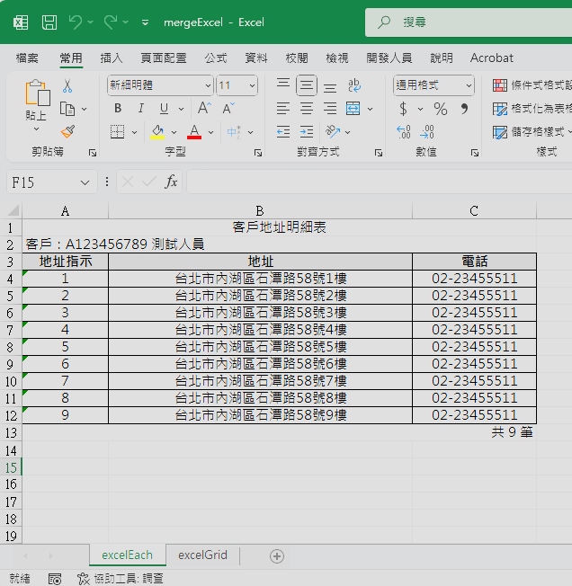
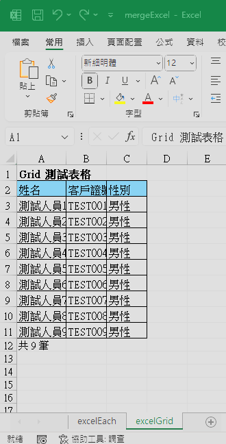

# Excel 檔案

## 安裝依賴

使用套件 `Jxls` 版本 `2`。

此套件 源自於 `apache.poi`，還可以透過 `樣版檔` 來達成 快速產生 Excel 檔案。

```xml
<!-- apache.poi -->
<dependency>
    <groupId>org.apache.poi</groupId>
    <artifactId>poi</artifactId>
    <version>5.2.3</version>
</dependency>
<dependency>
    <groupId>org.apache.poi</groupId>
    <artifactId>poi-ooxml</artifactId>
    <version>5.2.3</version>
</dependency>
<!-- JXLS -->
<dependency>
    <groupId>org.jxls</groupId>
    <artifactId>jxls-poi</artifactId>
    <version>2.12.0</version>
    <!-- 排除其自帶的 POI -->
    <exclusions>
        <exclusion>
            <groupId>org.apache.poi</groupId>
            <artifactId>*</artifactId>
        </exclusion>
    </exclusions>
</dependency>
```

## 工具

提供 Jxls 產生 Excel 的 核心程式。

- `generateExcel`：產生 Excel 檔案

- `generateExcelList`：產生 Excel 檔案 (相同樣板 + 多筆資料)

- `mergeExcel`：Excel 檔案合併 (針對一個工作表的檔案)

```java
import org.apache.commons.lang3.StringUtils;
import org.apache.poi.ss.usermodel.*;
import org.apache.poi.ss.util.CellRangeAddress;
import org.apache.poi.xssf.usermodel.XSSFWorkbook;
import org.jxls.common.Context;
import org.jxls.util.JxlsHelper;
import org.springframework.core.io.ClassPathResource;
import org.springframework.util.CollectionUtils;

import java.io.ByteArrayInputStream;
import java.io.ByteArrayOutputStream;
import java.io.InputStream;
import java.util.List;
import java.util.Map;

/**
 * Excel 匯出工具
 */
public class ExcelUtil {
    /**
     * 產生 Excel 檔案 (單筆資料)
     *
     * @param modelFile 樣版路徑 (resources/templates/{modelFile})
     * @param context   JXLS Context，包含資料模型與變數（例如 context.putVar("users", userList)）
     * @return 產出的 Excel 檔案資料流（byte[]）
     */
    public static byte[] generateExcel(String modelFile, Context context) {
        // 參數驗證
        if (StringUtils.isEmpty(modelFile)) {
            throw new RuntimeException("樣版路徑 不可空白!!");
        }
        if (context == null) {
            throw new RuntimeException("資料內容 不可空白!!");
        }

        // 樣板位置
        String model = "/templates/" + modelFile;

        // 產生檔案
        try (
                // 讀取 classpath 下的樣版 Excel 檔案
                InputStream inputStream = new ClassPathResource(model).getInputStream();

                // 建立輸出流，用來儲存產生的 Excel 內容
                ByteArrayOutputStream outputStream = new ByteArrayOutputStream()
        ) {
            // 處理 Excel 樣版，產生新的 Excel 並寫入 outputStream
            JxlsHelper.getInstance()
                    .setEvaluateFormulas(true) // 啟用 Excel 公式自動計算
                    .processTemplate(inputStream, outputStream, context);

            // 回傳產生好的 byte[]
            return outputStream.toByteArray();

        } catch (Exception e) {
            throw new RuntimeException("Excel 產生失敗，樣版路徑: " + modelFile, e);
        }
    }

    /**
     * 產生 Excel 檔案 (相同樣板 + 多筆資料)
     *
     * @param modelFile 樣版路徑 (resources/templates/{modelFile})
     * @param dataList  資料內容 清單 (Map key = 分頁名稱 / Map value = context)
     * @return 產出的 Excel 檔案資料流（byte[]）
     */
    public static byte[] generateExcelList(String modelFile, Map<String, Context> dataList) {
        // 參數驗證
        if (StringUtils.isEmpty(modelFile)) {
            throw new RuntimeException("樣版路徑 不可空白!!");
        }
        if (CollectionUtils.isEmpty(dataList)) {
            throw new RuntimeException("資料內容 不可空白!!");
        }

        try (
                Workbook mergedWorkbook = new XSSFWorkbook();
                ByteArrayOutputStream outputStream = new ByteArrayOutputStream()
        ) {

            int i = 0;
            for (Map.Entry<String, Context> data : dataList.entrySet()) {
                // 取得資料
                String sheetName = data.getKey();
                Context context = data.getValue();
                // 產生檔案
                byte[] file = generateExcel(modelFile, context);
                // 合併資料
                try (InputStream inputStream = new ByteArrayInputStream(file);
                     Workbook workbook = WorkbookFactory.create(inputStream)) {

                    // 取得第一個工作表
                    Sheet originalSheet = workbook.getSheetAt(0);

                    // 建立新工作表
                    sheetName = sheetName != null ? sheetName : "Sheet" + (i + 1);
                    Sheet newSheet = mergedWorkbook.createSheet(sheetName);

                    // 複製工作表內容
                    copySheet(mergedWorkbook, originalSheet, newSheet);
                }
                // 計數
                i++;
            }

            mergedWorkbook.write(outputStream);
            return outputStream.toByteArray();
        } catch (Exception e) {
            throw new RuntimeException("Excel 產生失敗，樣版路徑: " + modelFile, e);
        }
    }

    /**
     * Excel 檔案合併 (針對一個工作表的檔案)
     *
     * @param fileList 資料內容 清單 (Map key = 檔案名稱 / Map value = 檔案資料流)
     * @return 產出的 Excel 檔案資料流（byte[]）
     */
    public static byte[] mergeExcel(Map<String, byte[]> fileList) {
        // 參數驗證
        if (CollectionUtils.isEmpty(fileList)) {
            throw new RuntimeException("檔案清單 不可空白!!");
        }

        try (
                Workbook mergedWorkbook = new XSSFWorkbook();
                ByteArrayOutputStream outputStream = new ByteArrayOutputStream()
        ) {

            int i = 0;
            for (Map.Entry<String, byte[]> data : fileList.entrySet()) {
                // 取得資料
                String sheetName = data.getKey();
                byte[] file = data.getValue();
                // 合併資料
                try (InputStream inputStream = new ByteArrayInputStream(file);
                     Workbook workbook = WorkbookFactory.create(inputStream)) {

                    // 取得第一個工作表
                    Sheet originalSheet = workbook.getSheetAt(0);

                    // 建立新工作表
                    sheetName = sheetName != null ? sheetName : "Sheet" + (i + 1);
                    Sheet newSheet = mergedWorkbook.createSheet(sheetName);

                    // 複製工作表內容
                    copySheet(mergedWorkbook, originalSheet, newSheet);
                }
                // 計數
                i++;
            }

            mergedWorkbook.write(outputStream);
            return outputStream.toByteArray();
        } catch (Exception e) {
            throw new RuntimeException("Excel 產生失敗", e);
        }
    }

    /**
     * 複製工作表內容 (包含合併儲存格)
     */
    private static void copySheet(Workbook mergedWorkbook, Sheet originalSheet, Sheet newSheet) {
        // 1. 先處理合併儲存格區域
        copyMergedRegions(originalSheet, newSheet);

        // 2. 複製欄寬設定
        for (int i = 0; i < originalSheet.getRow(0).getLastCellNum(); i++) {
            newSheet.setColumnWidth(i, originalSheet.getColumnWidth(i));
        }

        // 3. 複製每一行
        for (int i = 0; i <= originalSheet.getLastRowNum(); i++) {
            Row originalRow = originalSheet.getRow(i);
            if (originalRow == null) {
                continue;
            }

            Row newRow = newSheet.createRow(i);

            // 4. 複製每個儲存格
            for (int j = 0; j < originalRow.getLastCellNum(); j++) {
                Cell originalCell = originalRow.getCell(j);
                if (originalCell == null) {
                    continue;
                }

                Cell newCell = newRow.createCell(j);
                copyCellValue(originalCell, newCell);
                copyCellStyle(mergedWorkbook, originalCell, newCell);
            }
        }
    }

    /**
     * 複製合併儲存格區域
     */
    private static void copyMergedRegions(Sheet originalSheet, Sheet newSheet) {
        // 取得原始工作表的所有合併區域
        List<CellRangeAddress> mergedRegions = originalSheet.getMergedRegions();

        // 將每個合併區域複製到新工作表
        for (CellRangeAddress mergedRegion : mergedRegions) {
            newSheet.addMergedRegion(mergedRegion);
        }
    }

    /**
     * 複製儲存格值
     */
    private static void copyCellValue(Cell originalCell, Cell newCell) {
        switch (originalCell.getCellType()) {
            case NUMERIC:
                newCell.setCellValue(originalCell.getNumericCellValue());
                break;
            case BOOLEAN:
                newCell.setCellValue(originalCell.getBooleanCellValue());
                break;
            case FORMULA:
                newCell.setCellFormula(originalCell.getCellFormula());
                break;
            case BLANK:
                newCell.setBlank();
                break;
            default:
                newCell.setCellValue(originalCell.getStringCellValue());
        }
    }

    /**
     * 複製儲存格樣式
     */
    private static void copyCellStyle(Workbook mergedWorkbook, Cell originalCell, Cell newCell) {
        CellStyle newCellStyle = mergedWorkbook.createCellStyle();
        newCellStyle.cloneStyleFrom(originalCell.getCellStyle());
        newCell.setCellStyle(newCellStyle);
    }
}
```

## 資料結構

```textile
java
├─ 📁constants                  
├─ 📁controller               
│   ├─ 📄 API 呼叫入口.java
├─ 📁service        
│   ├─ 📄 報表邏輯處理(生成資料數據).java
├─ 📁dto                        
│   ├─ 📄 資料傳輸物件.java
├─ 📁util                       
│   ├─ 📄 ExcelUtil.java    # Excel 的檔案生成工具

resources
├─ 📁 templates
│   ├─ 📄 樣板檔.xlsx
```

## 使用方式

1. 設定 樣版檔
   
   - 樣板變數 `${ }`。
   
   - 透過 Excel 的 註解 來 撰寫 jxls code。
   
   - 支援 Excel 的公式 與 設定。
   
   不同類型的樣版設定方式，請詳 `範例`。

2. 設定 資料內容
   
   於 JAVA Service 中進行：
   
   - 宣告 `Context context = new Context();`
   
   - 使用 `context.putVar(..., ...);` 設定資料內容
     
     - **參數 1**：設定 `樣版檔 變數名稱`。
     
     - **參數 2**：設定 `顯示的數值`。

3. 將 樣板檔位置 及 資料內容 傳入 工具程式，產出 Excel 檔案。

## 使用範例

### 1. Each 遞迴表格

#### 1.1. 樣版檔

1. 於 `/resources/templates/` 新增 Excel檔案 `sampleEach.xlsx`。

2. 請根據下圖方式，設定樣版檔
   
   - A1 儲存格：設定 掃瞄範圍
     
     ```xlsx
     jx:area(lastCell="C5")
     ```
     
     `lastCell="C5`：模板範圍 (A1 ~ C5)
   
   - A2 儲存格：
     
     - `${clientId}`：Java 傳入 `clientId` 設定 客戶ID。
     
     - `${names}`：Java 傳入 `names` 設定 客戶姓名。
   
   - A4 儲存格：設定 遞迴表格
   
   ```xlsx
   jx:each(items="addr" var="a" 
   orderBy="a.addrInd ASC" lastCell="C4")
   ```
   
   - `jx:each(...)`：遞迴表格 的語法
     
     - `items="addr"`：Java 傳入 `addr` 設定 地址清單資料來源
     
     - `var="a"`：樣版 端 設定 變數別名
     
     - `orderBy="a.addrInd ASC"`：資料排序
     
     - `lastCell="C4"`：設定 迴圈 的 結尾；A2 設定 代表 模板範圍 (A2 ~ C4)
     
     - `${addr.size()}`：透過 Jxls 的 函式 `.size()` 計算筆數，
       
       也可用 Excel 公式取代。
   
   

#### 1.2. 資料內容

##### 1.2.1. 單筆資料

- Service
  
  1. 取得來源資料
  
  2. 設定 資料內容
     
     - 根據 樣版檔 的設定，將對應資料 寫入 `context` 中。
  
  3. 最後透過 工具 產生 Excel。
  
  ```java
      /**
       * Excel 的 Each 遞迴資料
       *
       * @return
       */
      public byte[] excelEach() {
          String userId = "A123456789";
          String userName = "測試人員";
          List<AddrDTO> addrList = new ArrayList<>();
          for (int i = 1 ; i <= 9 ; i++) {
              AddrDTO addr = new AddrDTO();
              addr.setAddrInd(String.valueOf(i));
              addr.setAddress("台北市內湖區石潭路58號"+i+"樓");
              addr.setTel("02-23455511");
              addrList.add(addr);
          }
  
          // 設定 資料內容
          Context context = new Context();
          context.putVar("clientId", userId);
          context.putVar("names", userName);
          context.putVar("addr", addrList);
  
          return ExcelUtil.generateExcel("sampleEach.xlsx", context);
      }
  ```

- controller
  
  ```java
      @Operation(summary = "Excel 報表測試: Each 遞迴表格",
              description = "Excel 報表測試: Each 遞迴表格")
      @PostMapping("/excelEach")
      public ResponseEntity<Resource> excelEach() {
          var file = excelService.excelEach();
          return ReponseUtil.responseEntity("Each測試表格.xlsx", file);
      }
  ```


##### 1.2.2. 多筆資料

- Service
  
  1. 取得來源資料
  
  2. 設定 資料內容
     
     - 根據 樣版檔 的設定，將對應資料 寫入 `context` 中。
     
     - 因為是 多筆資料，所以 要整理成 `Map<String, Context>`
       
       - **key**：工作表 顯示的文字
       
       - **valse**：工作表 的 資料內容
  
  3. 最後透過 工具 產生 Excel。
  
  ```java
      /**
       * Excel 的 Each 遞迴資料 (多筆資料)
       *
       * @return
       */
      public byte[] excelEachAll() {
          Map<String, Context> dataMap = new HashMap<>();
          for (int i = 1 ; i <= 5 ; i++) {
              String userId = "TEST00"+i;
              String userName = "測試人員"+i;
              List<AddrDTO> addrList = new ArrayList<>();
              for (int j = 1 ; j <= 9 ; j++) {
                  AddrDTO addr = new AddrDTO();
                  addr.setAddrInd(String.valueOf(j));
                  addr.setAddress("台北市內湖區石潭路58號"+j+"樓");
                  addr.setTel("02-23455511");
                  addrList.add(addr);
              }
              // 設定 資料內容
              Context context = new Context();
              context.putVar("clientId", userId);
              context.putVar("names", userName);
              context.putVar("addr", addrList);
  
              dataMap.put(userId, context);
          }
  
          return ExcelUtil.generateExcelList("sampleEach.xlsx", dataMap);
      }
  ```

- Controller
  
  ```java
    @Operation(summary = "Excel 報表測試: Each 遞迴表格",
            description = "Excel 報表測試: Each 遞迴表格",
            operationId = "excelEach")
    @GetMapping("/excelEach")
    public ResponseEntity<Resource> excelEach(@RequestParam String clientId) {
        var file = exportService.excelEach(clientId);
        return ExportReponseUtil.responseEntity("Each測試表格.xlsx", file);
    }
  ```


### 2. Grid 動態表格

#### 2.1. 樣版檔

1. 於 `/resources/templates/` 新增 Excel檔案 `sampleGrid.xlsx`。

2. 請根據下圖方式，設定樣版檔
   
   - A1 儲存格：設定 掃瞄範圍
     
     ```xlsx
     jx:area(lastCell="A4")
     ```
     
     - `lastCell="A4"`：模板範圍 (A1 ~ A4)
   
   - A1 儲存格：Java 傳入 `title` 設定 報表標題。
   
   - A2 儲存格：設定 動態表格
   
   ```xlsx
   jx:grid(lastCell="A3" headers="headers" 
   data="dataList" areas=["A2:A2","A3:A3"])
   ```
   
   - `jx:grid(...)`：動態表格 的語法
     
     - `lastCell="A3"`：動態表格 的 模板範圍 (A2 ~ A3)
     
     - `headers="headers"`：Java 傳入 `headers` 設定 標題
     
     - `data="dataList"`：Java 傳入 `dataList` 設定 資料內容
     
     - `areas=["A2:A2","A3:A3"]`：模板區塊
       
       - 參數 1 `"A2:A2"` 代表 標題 的位置，此位置要設定 `${header}`
       
       - 參數 2 `"A3:A3"` 代表 內容 的位置，此位置要設定 `${cell}`
   
   - `${dataList.size()}`：透過 Jxls 的 函式 `.size()` 計算筆數，
     
     也可用 Excel 公式取代。


#### 2.2. 資料內容

- Service
  
  1. 取得來源資料
  
  2. 整理數據
     
     需要設定 報表名稱、標題、資料內容，這三個部分。
     
     - 標題：
       
       對應 `樣本的 headers`，格式為 `List<String>`。
     
     - 資料內容：
       
       對應 `樣本的 dataList`，格式為 `List<List<Object>>`。
       
       資料寫入順序，對應 headers 的欄位順序
  
  3. 設定 資料內容
     
     - 根據 樣版檔 的設定，將對應資料 寫入 `context` 中。
  
  4. 最後透過 工具 產生 Excel。
     
     ```java
     /**
     * Excel 的 Grid 動態資料
     *
     * @return
     */
     public byte[] excelGrid() {
       // 設定 headers
       List<String> headers = Arrays.asList("姓名", "客戶證號", "性別");
       // 設定 數據集合: 使用 List<List<Object>> 封裝
       // List<Object> 的寫入順序，對應 headers 的欄位順序
       List<List<Object>> dataList = new ArrayList<>();
       for (int i = 1 ; i <= 9 ; i++) {
           List<Object> data = new ArrayList<>();
           String userName = "測試人員"+i;
           String userId = "TEST00"+i;
           String userSex = "男性";
           data.add(userName);
           data.add(userId);
           data.add(userSex);
           dataList.add(data);
     
       }
     
       // 設定 資料內容
       Context context = new Context();
       context.putVar("title", "Grid 測試表格");
       context.putVar("headers", headers);
       context.putVar("dataList", dataList);
     
       return ExcelUtil.generateExcel("sampleGrid.xlsx", context);
     }
     ```

- Controller
  
  ```java
      @Operation(summary = "Excel 報表測試: Grid 動態表格",
              description = "Excel 報表測試: Grid 動態表格")
      @PostMapping("/excelGrid")
      public ResponseEntity<Resource> excelGrid() {
          var file = excelService.excelGrid();
          return ReponseUtil.responseEntity("Grid測試表格.xlsx", file);
      }
  ```


### 3. Excel 多檔合併

範例使用 上面的 `Each 遞迴表格` 和 `Grid 動態表格` 來進行 多檔合併 的示範。

#### 3.1. 資料內容

- Service
  
  1. 呼叫 上面的方法，產生 Excel 檔案。
  
  2. 最後透過 工具 產生 Excel。
  
  ```java
  /**
   * Excel 檔案合併
   *
   * @return
   */
  public byte[] mergeExcel() {
      Map<String, byte[]> fileList = new HashMap<>();
      fileList.put("excelEach", excelEach());
      fileList.put("excelGrid", excelGrid());
  
      return ExcelUtil.mergeExcel(fileList);
  }
  ```

- Controller
  
  ```java
  @Operation(summary = "Excel 檔案合併",
          description = "Excel 檔案合併")
  @PostMapping("/mergeExcel")
  public ResponseEntity<Resource> mergeExcel() {
      var file = excelService.mergeExcel();
      return ReponseUtil.responseEntity("mergeExcel.xlsx", file);
  }
  ```



