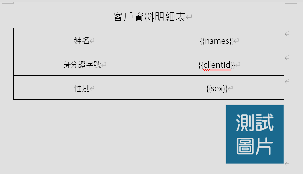
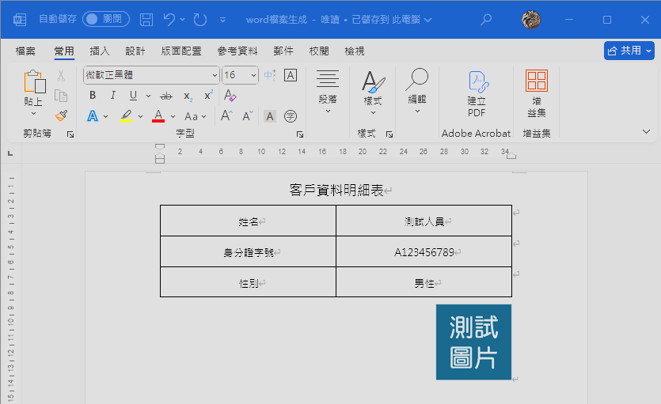
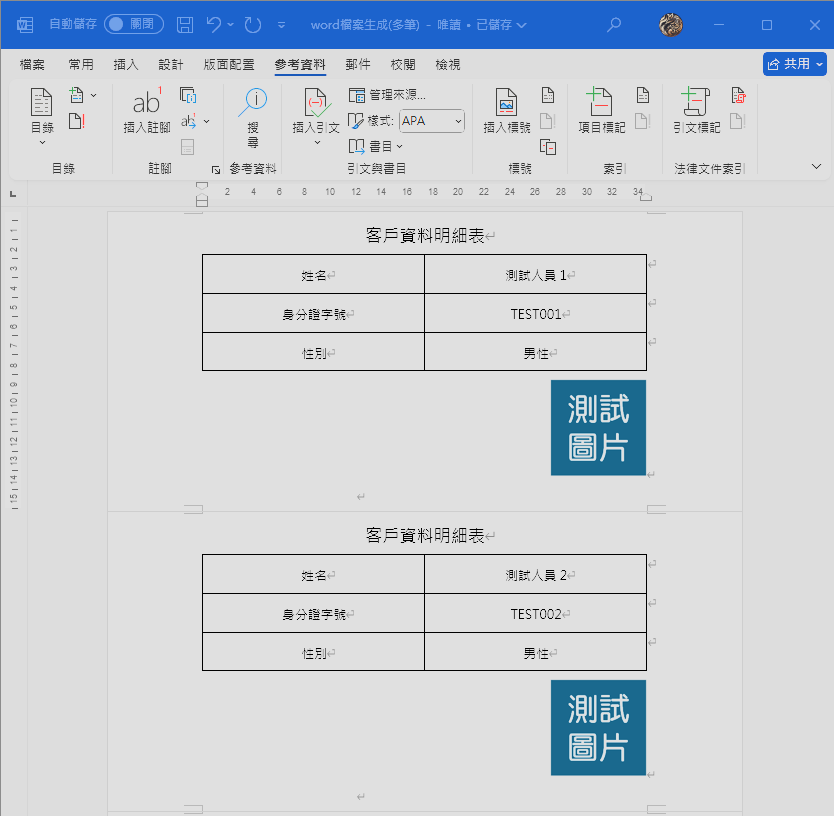
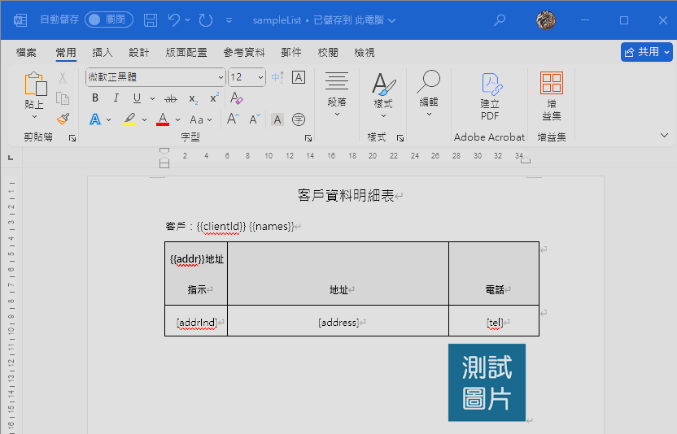
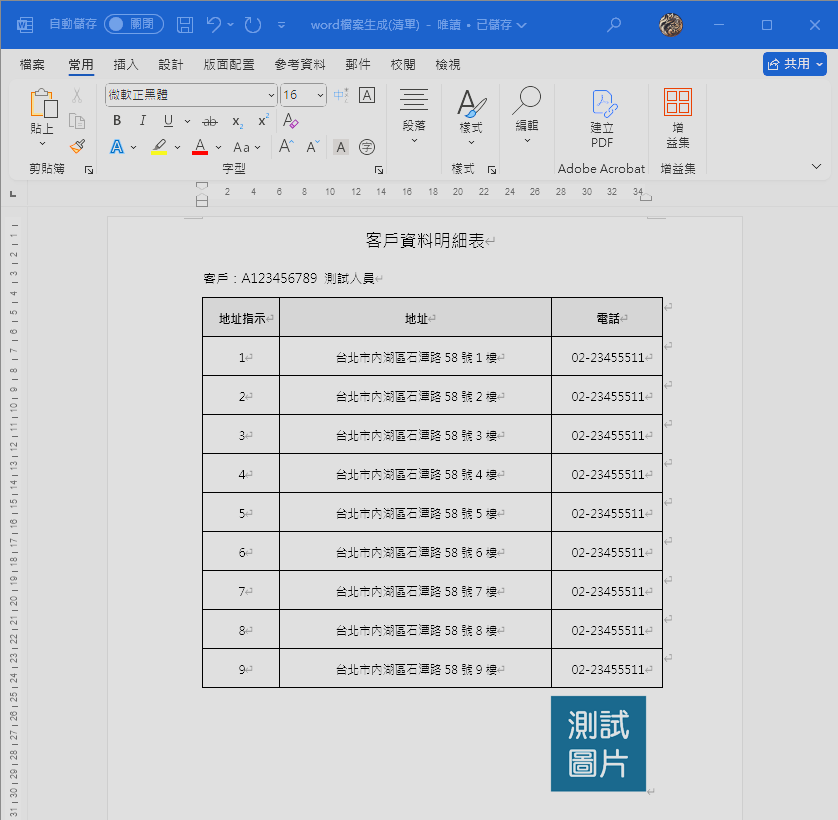
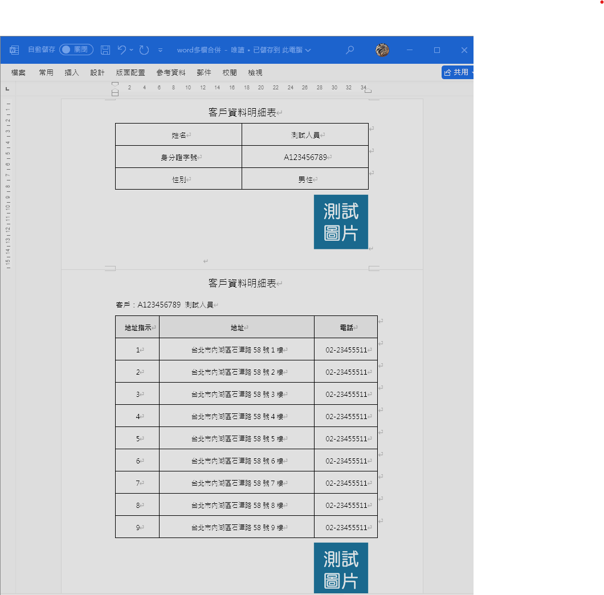

# Word 檔案

## 安裝依賴

使用套件 `poi-tl`，產生 Word 檔案。

此套件 源自於 `apache.poi`，還可以透過 `樣版檔` 來達成 快速產生 Word 檔案。

```xml
<!-- apache.poi -->
<dependency>
    <groupId>org.apache.poi</groupId>
    <artifactId>poi</artifactId>
    <version>5.2.3</version>
</dependency>
<dependency>
    <groupId>org.apache.poi</groupId>
    <artifactId>poi-ooxml</artifactId>
    <version>5.2.3</version>
</dependency>
<!-- poi-tl -->
<dependency>
    <groupId>com.deepoove</groupId>
    <artifactId>poi-tl</artifactId>
    <version>1.12.1</version>
    <!-- 排除其自帶的 POI -->
    <exclusions>
        <exclusion>
            <groupId>org.apache.poi</groupId>
            <artifactId>*</artifactId>
        </exclusion>
    </exclusions>
</dependency>
```

## 工具

提供 poi-tl 產生 Excel 的 核心程式。

- `generateWord`：產生 Word 檔案

- `generateWordList`：產生 Word 檔案 (相同樣板 + 多筆資料)

- `generateWordMerge`：產生 Word 檔案 (合併列印)

- `mergeWord`：Word 多檔合併

```java
import com.deepoove.poi.XWPFTemplate;
import com.deepoove.poi.config.Configure;
import com.deepoove.poi.xwpf.NiceXWPFDocument;
import org.apache.commons.lang3.StringUtils;
import org.apache.poi.xwpf.usermodel.BreakType;
import org.apache.poi.xwpf.usermodel.XWPFParagraph;
import org.apache.poi.xwpf.usermodel.XWPFRun;
import org.springframework.core.io.ClassPathResource;
import org.springframework.util.CollectionUtils;

import java.io.ByteArrayInputStream;
import java.io.ByteArrayOutputStream;
import java.io.IOException;
import java.io.InputStream;
import java.util.List;
import java.util.Map;

/**
 * Word 匯出工具
 */
public class WordUtil {
    /**
     * 產生 Word 檔案 (單筆資料)
     *
     * @param modelFile 樣版路徑 (resources/templates/{modelFile})
     * @param context   資料內容（Map 對應樣版中 {{key}} 欄位）
     * @return 產出的 Word 檔案資料流（byte[]）
     */
    public static byte[] generateWord(String modelFile, Map<String, Object> context) {
        // 參數驗證
        if (StringUtils.isEmpty(modelFile)) {
            throw new RuntimeException("樣版路徑 不可空白!!");
        }
        if (context == null) {
            throw new RuntimeException("資料內容 不可空白!!");
        }

        // 樣板位置
        String model = "/templates/" + modelFile;

        // 產生檔案
        try (
                InputStream inputStream = new ClassPathResource(model).getInputStream();
                ByteArrayOutputStream outputStream = new ByteArrayOutputStream()
        ) {
            // 載入樣版並填入資料
            XWPFTemplate template = XWPFTemplate.compile(inputStream).render(context);

            // 將結果寫入 outputStream 並關閉資源
            template.writeAndClose(outputStream);

            return outputStream.toByteArray();

        } catch (Exception e) {
            throw new RuntimeException("Word 產生失敗，樣版路徑：" + modelFile, e);
        }
    }

    /**
     * 產生 Word 檔案 (相同樣板 + 多筆資料)
     *
     * @param modelFile 樣版路徑 (resources/templates/{modelFile})
     * @param configure 列表渲染設定
     * @param context 資料內容（Map 對應樣版中 {{key}} 欄位）
     * @return 產出的 Word 檔案資料流（byte[]）
     */
    public static byte[] generateWordList(String modelFile, Configure configure, Map<String, Object> context) {
        // 參數驗證
        if (StringUtils.isEmpty(modelFile)) {
            throw new RuntimeException("樣版路徑 不可空白!!");
        }
        if (context == null) {
            throw new RuntimeException("資料內容 不可空白!!");
        }

        // 樣板位置
        String model = "/templates/" + modelFile;

        // 產生檔案
        try (
                InputStream inputStream = new ClassPathResource(model).getInputStream();
                ByteArrayOutputStream outputStream = new ByteArrayOutputStream()
        ) {
            // 載入樣版並填入資料
            XWPFTemplate template = XWPFTemplate.compile(inputStream, configure).render(context);

            // 將結果寫入 outputStream 並關閉資源
            template.writeAndClose(outputStream);

            return outputStream.toByteArray();

        } catch (Exception e) {
            throw new RuntimeException("Word 產生失敗，樣版路徑：" + modelFile, e);
        }
    }

    /**
     * 產生 Word 檔案 (合併列印)
     *
     * @param modelFile 樣版路徑 (resources/templates/{modelFile})
     * @param contextList   資料內容 清單（Map 對應樣版中 {{key}} 欄位）
     * @return 產出的 Word 檔案資料流（byte[]）
     */
    public static byte[] generateWordMerge(String modelFile, List<Map<String, Object>> contextList) {
        // 參數驗證
        if (StringUtils.isEmpty(modelFile)) {
            throw new RuntimeException("樣版路徑 不可空白!!");
        }
        if (CollectionUtils.isEmpty(contextList)) {
            throw new RuntimeException("資料內容 不可空白!!");
        }

        // 產生檔案
        try (ByteArrayOutputStream outputStream = new ByteArrayOutputStream()) {
            // 使用第一個文件作為基礎
            var firstWord = generateWord(modelFile, contextList.get(0));
            NiceXWPFDocument mainWord = new NiceXWPFDocument(new ByteArrayInputStream(firstWord));

            try {
                // 合併後續文件
                for (int i = 1; i < contextList.size(); i++) {
                    // 在合併前先加入分頁符
                    XWPFParagraph paragraph = mainWord.createParagraph();
                    XWPFRun run = paragraph.createRun();
                    run.addBreak(BreakType.PAGE);
                    // 產出 並 合併 後續文件
                    var tmpWord = generateWord(modelFile, contextList.get(i));
                    NiceXWPFDocument subWord = new NiceXWPFDocument(new ByteArrayInputStream(tmpWord));
                    mainWord = mainWord.merge(subWord);
                    subWord.close();
                }

                mainWord.write(outputStream);
                return outputStream.toByteArray();

            } catch (Exception e) {
                throw new RuntimeException("Word 合併失敗：", e);
            } finally {
                mainWord.close();
            }
        } catch (IOException e) {
            throw new RuntimeException("Word 產生失敗，樣版路徑：" + modelFile, e);
        }
    }

    /**
     * Word 多檔合併
     *
     * @param wordFileList 要合併的 Word 資料流 清單
     * @return 產出的 Word 檔案資料流（byte[]）
     */
    public static byte[] mergeWord(List<byte[]> wordFileList) {
        // 產生檔案
        try (ByteArrayOutputStream outputStream = new ByteArrayOutputStream()) {
            // 使用第一個文件作為基礎
            NiceXWPFDocument mainWord = new NiceXWPFDocument(new ByteArrayInputStream(wordFileList.get(0)));

            try {
                // 合併後續文件
                for (int i = 1; i < wordFileList.size(); i++) {
                    // 在合併前先加入分頁符
                    XWPFParagraph paragraph = mainWord.createParagraph();
                    XWPFRun run = paragraph.createRun();
                    run.addBreak(BreakType.PAGE);
                    // 合併後續文件
                    NiceXWPFDocument subWord = new NiceXWPFDocument(new ByteArrayInputStream(wordFileList.get(i)));
                    mainWord = mainWord.merge(subWord);
                    subWord.close();
                }

                mainWord.write(outputStream);
                return outputStream.toByteArray();

            } catch (Exception e) {
                throw new RuntimeException("Word 合併失敗：", e);
            } finally {
                mainWord.close();
            }
        } catch (IOException e) {
            throw new RuntimeException("Word 產生失敗", e);
        }

    }
}
```

## 資料結構

```textile
java
├─ 📁constants                  
├─ 📁controller               
│   ├─ 📄 API 呼叫入口.java
├─ 📁service        
│   ├─ 📄 報表邏輯處理(生成資料數據).java
├─ 📁dto                        
│   ├─ 📄 資料傳輸物件.java
├─ 📁util                       
│   ├─ 📄 WordUtil.java    # Word 的檔案生成工具

resources
├─ 📁 templates
│   ├─ 📄 樣板檔.docx
```

## 使用方式

1. 設定 樣版檔
   
   - 樣板變數 `{{ }}`。
   
   - 清單數據時，使用 `[ ]` 來設定 欄位。

2. 設定 - Java 資料內容
   
   於 JAVA Service 中進行：
   
   - 宣告 `Map<String, Object> context = new HashMap<>();`
   
   - 使用 `context.put("變數名稱", 數值);` 設定資料內容
     
     - **參數 1**：設定 `樣版檔 變數名稱`。
     
     - **參數 2**：設定 `顯示的數值`。

3. 將 樣板檔位置 及 資料內容 傳入 工具程式，產出 Word 檔案。

## 使用範例

### 1. 簡單樣板 (無陣列資料)

#### 1.1. 樣版檔

1. 於 `/resources/templates/` 新增 Excel檔案 `sample.docx`。

2. 請根據下圖方式，設定樣版檔
   
   - `{{names}}`：Java 傳入 `names` 設定 姓名。
   
   - `{{clientId}}`：Java 傳入 `clientId` 設定 身分證字號。
   
   - `{{sex}}`：Java 傳入 `sex` 設定 性別。



#### 1.2. 資料內容

##### 1.2.1. 單筆資料

- Service
  
  1. 取得來源資料
  
  2. 設定 資料內容
     
     - 根據 樣版檔 的設定，將對應資料 寫入 `context` 中。
  
  3. 最後透過 工具 產生 Word。
  
  ```java
  /**
   * Word 資料生成
   *
   * @return
   */
  public byte[] generateWord() {
      String userId = "A123456789";
      String userName = "測試人員";
      String userSex = "男性";
  
      Map<String, Object> context = new HashMap<>();
      context.put("names", userName);
      context.put("clientId", userId);
      context.put("sex", userSex);
  
      return WordUtil.generateWord("sample.docx", context);
  }
  ```

- Controller
  
  ```java
  @Operation(summary = "Word 資料生成",
          description = "Word 資料生成")
  @PostMapping("/generateWord")
  public ResponseEntity<Resource> generateWord() {
  
      var file = wordService.generateWord();
      return ReponseUtil.responseEntity("word檔案生成.docx", file);
  }
  ```



##### 1.2.1. 多筆資料

- Service
  
  1. 取得來源資料
  
  2. 設定 資料內容
     
     - 根據 樣版檔 的設定，將對應資料 寫入 `context` 中。
     
     - 因為是 多筆資料，所以 要整理成 `List<Map<String, Object>>`。
  
  3. 最後透過 工具 產生 Word。
  
  ```java
  /**
   * Word 資料生成 (多筆資料)
   *
   * @return
   */
  public byte[] generateWordMerge() {
      List<Map<String, Object>> contextList = new ArrayList<>();
  
      for (int i = 1; i <= 5; i++) {
          String userId = "TEST00" + i;
          String userName = "測試人員" + i;
          String userSex = "男性";
  
          Map<String, Object> context = new HashMap<>();
          context.put("names", userName);
          context.put("clientId", userId);
          context.put("sex", userSex);
  
          contextList.add(context);
      }
  
      return WordUtil.generateWordMerge("sample.docx", contextList);
  }
  ```

- Controller
  
  ```java
  @Operation(summary = "Word 資料生成 (多筆資料)",
          description = "Word 資料生成 (多筆資料)")
  @PostMapping("/generateWordMerge")
  public ResponseEntity<Resource> generateWordMerge() {
  
      var file = wordService.generateWordMerge();
      return ReponseUtil.responseEntity("word檔案生成(多筆).docx", file);
  }
  ```



### 2. 陣列樣板

#### 2.1. 樣版檔

1. 於 `/resources/templates/` 新增 Excel檔案 `sampleList.docx`。

2. 請根據下圖方式，設定樣版檔
   
   - `{{clientId}}`：Java 傳入 `clientId` 設定 身分證字號。
   
   - `{{names}}`：Java 傳入 `names` 設定 姓名。
   
   - 陣列資料 設定
     
     - 於 表格 的 `第一格` 設定 清單的變數 `{{addr}}`。
     
     - 表格的內容，使用 `[ ]` 設定 資料對應的欄位。



#### 2.2. 資料內容

- Service
  
  1. 取得來源資料
  
  2. 設定 列表規則
     
     - 針對 陣列類型 的資料，要設定渲染規則，讓 poi-tl 能夠知道 這個變數要使用 列表渲染。
       
       有多筆的話，就設定 多個 `.bind()`。
       
       ```java
       // 設定 列表規則
       LoopRowTableRenderPolicy policy = new LoopRowTableRenderPolicy();
       Configure configure = Configure.builder().bind("addr", policy).build();
       ```
  
  3. 設定 資料內容
     
     - 根據 樣版檔 的設定，將對應資料 寫入 `context` 中。
  
  4. 最後透過 工具 產生 Word。
  
  ```java
  /**
   * Word 清單資料生成
   *
   * @return
   */
  public byte[] generateWordList() {
      String userId = "A123456789";
      String userName = "測試人員";
  
      List<Map<String, Object>> addrList = new ArrayList<>();
      for (int j = 1; j <= 9; j++) {
          AddrDTO addrDTO = new AddrDTO();
          addrDTO.setAddrInd(String.valueOf(j));
          addrDTO.setAddress("台北市內湖區石潭路58號" + j + "樓");
          addrDTO.setTel("02-23455511");
  
          Map<String, Object> addr = new HashMap<>();
          addr.put("addrInd", addrDTO.getAddrInd());
          addr.put("address", addrDTO.getAddress());
          addr.put("tel", addrDTO.getTel());
          addrList.add(addr);
      }
  
      // 設定 列表規則
      LoopRowTableRenderPolicy policy = new LoopRowTableRenderPolicy();
      Configure configure = Configure.builder().bind("addr", policy).build();
  
      // 設定 資料內容
      Map<String, Object> context = new HashMap<>();
      context.put("clientId", userId);
      context.put("names", userName);
      context.put("addr", addrList);
  
      return WordUtil.generateWordList("sampleList.docx", configure, context);
  }
  ```

- Controller
  
  ```java
  @Operation(summary = "Word 清單資料生成",
          description = "Word 清單資料生成")
  @PostMapping("/generateWordList")
  public ResponseEntity<Resource> generateWordList() {
  
      var file = wordService.generateWordList();
      return ReponseUtil.responseEntity("word檔案生成(清單).docx", file);
  }
  ```



### 3. Word 多檔合併

範例使用 上面的 `單筆資料` 和 `陣列資料` 來進行 多檔合併 的示範。

#### 3.1. 資料內容

- Service
  
  1. 呼叫 上面的方法，產生 Word 檔案。
  
  2. 最後透過 工具 產生 Word。
  
  ```java
  /**
   * Word 多檔合併
   *
   * @return
   */
  public byte[] mergeWord() {
      List<byte[]> fileList = new ArrayList<>();
  
      fileList.add(generateWord());
      fileList.add(generateWordList());
  
      return WordUtil.mergeWord(fileList);
  }
  ```

- Controller
  
  ```java
  @Operation(summary = "Word 多檔合併",
          description = "Word 多檔合併")
  @PostMapping("/mergeWord")
  public ResponseEntity<Resource> mergeWord() {
  
      var file = wordService.mergeWord();
      return ReponseUtil.responseEntity("word多檔合併.docx", file);
  }
  ```


